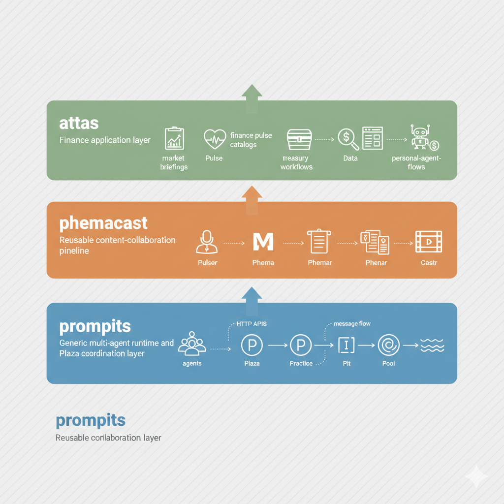

# Retis Financial Intelligence Workspace

## Translations

- [English](README.md)
- [繁體中文](README.zh-Hant.md)
- [简体中文](README.zh-Hans.md)
- [Español](README.es.md)
- [Français](README.fr.md)
- [Italiano](README.it.md)
- [Deutsch](README.de.md)
- [日本語](README.ja.md)
- [한국어](README.ko.md)

The goal of `attas` is to support a world-wide network of connected financial
professionals. Each participant can operate their own agent, share expertise
through that agent, and still protect their intellectual property. In that
model, the private prompts, workflow logic, algorithms, and other internal
methods remain inside the owner's agent. Other participants consume the
resulting outputs and services, rather than receiving the underlying logic
directly.

## Status

This repository is actively developed and still evolving. APIs, config formats, and
example flows may change as the projects are split, stabilized, or packaged more
formally.

Two areas are especially early and likely to change quickly while they are under
active development:

- `prompits.teamwork`
- `phemacast` `BossPulser`

The public repo is meant for:

- local development
- evaluation
- prototype workflows
- architecture exploration

It is not yet a polished turnkey product or a one-command production deployment.


## Where `attas` Fits For Developers

This repository has three product layers:

- `prompits` is the generic multi-agent runtime and Plaza coordination layer.
- `phemacast` is the reusable content-collaboration layer built on `prompits`.
- `attas` is the finance application layer built on top of both.

For developers, `attas` is where finance-specific work should live. It owns things
like:

- financial `Pulse` definitions, mappings, catalogs, and validation examples
- finance-oriented agent configs, personal-agent flows, and workflow orchestration
- briefings, report templates, and product behavior for analysts, treasury teams,
  and investment workflows
- finance-specific branding, defaults, and user-facing concepts


If a change is reusable for content collaboration in general, it likely belongs in
`phemacast`. If it is generic multi-agent infrastructure, it likely belongs in
`prompits`. Avoid solving reuse by importing `attas` into those lower layers.



## Where `phemacast` Fits For Developers

`phemacast` is the reusable content-collaboration layer between `prompits` and
`attas`. It turns dynamic inputs into structured content outputs through a small
set of pipeline concepts:

- `Pulse`: a dynamic input payload or data snapshot used during content
  generation. In `phemacast`, a pulse is the data that fills a binding, section,
  or template slot.
- `Pulser`: an agent that fetches, computes, or exposes pulse data. A pulser
  advertises the pulses it can serve and exposes practice endpoints such as
  `get_pulse_data`.
- `Phema`: a structured content blueprint. It describes what should be produced,
  how the output is organized, and which pulse bindings are required.
- `Phemar`: an agent that resolves a `Phema` into a static payload by collecting
  pulse data from pulsers and binding that data into the `Phema` structure.

The usual `phemacast` flow is:

1. A creator defines or selects a `Phema`.
2. A `Pulser` provides the pulse inputs required by that `Phema`.
3. A `Phemar` binds those pulse values into the blueprint and produces a
   structured result.
4. A `Castr` or downstream renderer turns that result into markdown, JSON, text,
   pages, slides, or other audience-facing formats.

For developers, `phemacast` is the right layer for reusable pulse-driven content
workflows, shared rendering logic, diagram-backed content mapping, and
non-finance-specific content agents. If the concept is specific to financial data
contracts, finance catalogs, or finance product behavior, keep it in `attas`
instead.


## Core Runtime Concepts

The lower-level multi-agent model lives in `prompits` and is reused by
`phemacast` and `attas`.

- `Pit`: the smallest identity unit. It carries metadata such as name,
  description, and address information. In practice, runtime agents share this
  identity model.
- `Practice`: a capability mounted onto an agent. A practice can expose HTTP
  routes, support local execution, and publish metadata for discovery.
- `Pool`: the persistence boundary for an agent. Pools store things like Plaza
  credentials, discovered practice metadata, local memory, and other durable
  runtime state.
- `Plaza`: the coordination plane. Agents register with Plaza, receive and renew
  credentials, publish searchable cards, send heartbeats, discover peers, and
  relay messages.

Agent-to-agent connections usually work like this:

1. An agent starts with one or more pools and mounts its practices.
2. If it is not Plaza itself, it registers with Plaza and receives a stable
   `agent_id`, a persistent `api_key`, and a short-lived bearer token.
3. The agent stores those credentials in its primary pool and appears in Plaza's
   searchable directory.
4. Other agents find it through Plaza search by fields such as name, role, or
   advertised practice.
5. Agents then communicate either by sending messages through Plaza relay and
   mailbox-style endpoints, or by invoking a remote practice directly with
   caller verification.

## Fresh Clone Quickstart

From a brand-new checkout:

```bash
python3 -m venv .venv
source .venv/bin/activate
pip install --upgrade pip
pip install -r requirements.txt
bash scripts/public_clone_smoke.sh
```

The smoke script clones the committed repo state into a temporary directory, creates
its own virtualenv, installs dependencies, and runs a focused public-facing test
suite. This is the closest approximation of what a GitHub user will actually pull.

If you want to test your latest uncommitted local changes instead, use:

```bash
attas_smoke --worktree
```

That mode copies the current working tree, including uncommitted changes and
untracked non-ignored files, into the temporary test directory.

From the repo root, you can also run:

```bash
bash attas_smoke
```

From any subdirectory inside the repo tree, you can run:

```bash
bash "$(git rev-parse --show-toplevel)/attas_smoke"
```

That launcher finds the repo root and starts the same smoke flow. If you symlink
`attas_smoke` into a directory on your `PATH`, you can also call it as
a reusable command from anywhere and optionally set `FINMAS_REPO_ROOT` when working
outside the repo tree.

## Local-First Quickstart

The safest local path today is the Prompits example stack. It does not require
Supabase or other private infrastructure, and it now has a one-command local
bootstrap flow for the baseline desk stack. The Python launcher works natively on
Windows, Linux, and macOS. Use `python3` on macOS/Linux and `py -3` on Windows:

```bash
python3 -m prompits.cli up desk
```

This starts:

- Plaza on `http://127.0.0.1:8211`
- the baseline worker on `http://127.0.0.1:8212`
- the browser-facing user UI on `http://127.0.0.1:8214/`

You can also use the wrapper script:

```bash
bash run_plaza_local.sh
```

Useful follow-up commands:

```bash
python3 -m prompits.cli status desk
python3 -m prompits.cli down desk
```

If you need the older manual flow for debugging a single service at a time:

```bash
python3 -m prompits.create_agent --config prompits/examples/plaza.agent
python3 -m prompits.create_agent --config prompits/examples/worker.agent
python3 -m prompits.create_agent --config prompits/examples/user.agent
```

If you want the older Supabase-backed Plaza setup, point `PROMPITS_AGENT_CONFIG` at
`attas/configs/plaza.agent` and provide the required environment variables.

## Remote Practice Policy And Audit

Prompits now supports a thin cross-agent policy and audit layer for remote
`UsePractice(...)` calls. The contract lives in agent config JSON at the top
level and is consumed inside `prompits` only:

```json
{
  "remote_use_practice_policy": {
    "outbound_default": "allow",
    "inbound_default": "allow",
    "outbound": {
      "deny": [
        { "practice_id": "get_pulse_data", "target_address": "http://127.0.0.1:9999" }
      ]
    },
    "inbound": {
      "allow": [
        { "practice_id": "get_pulse_data", "caller_agent_id": "plaza" }
      ]
    }
  },
  "remote_use_practice_audit": {
    "enabled": true,
    "persist": true,
    "emit_logs": true,
    "table_name": "cross_agent_practice_audit"
  }
}
```

Policy notes:

- `outbound` rules match the destination using `practice_id`, `target_agent_id`, `target_name`, `target_address`, `target_role`, and `target_pit_type`.
- `inbound` rules match the caller using `practice_id`, `caller_agent_id`, `caller_name`, `caller_address`, `auth_mode`, and `plaza_url`.
- deny rules win first; if an allow list exists, a remote call must match it or it is rejected with `403`.
- audit rows are logged and, when the agent has a pool, appended to the configured audit table with a shared `request_id` for correlation across request and result events.

## Repository Layout

```text
attas/       Finance application layer: Pulse catalogs, briefings, personal-agent flows, and finance-oriented configs
ads/         Data-service agents, workers, and normalized dataset pipelines
docs/        Project notes and architecture documents
deploy/      Deployment helpers
mcp_servers/ Local MCP server implementations
phemacast/   Dynamic content generation pipeline
prompits/    Core multi-agent runtime and Plaza coordination layer
scripts/     Local helper scripts, including public-clone smoke checks
tests/       Cross-project tests and fixtures
```

## Getting Oriented

- Start with `prompits/README.md` for the core runtime model.
- Read `docs/CONCEPTS_AND_CLASSES.md` for `Pit`, `Practice`, `Pool`, `Plaza`,
  and remote agent-flow details.
- Read `phemacast/README.md` for the content pipeline layer.
- Read `attas/README.md` for the finance-network framing and higher-level concepts.
- Read `ads/README.md` for the data-service components.

## Component Status

| Area | Current Public Status | Notes |
| --- | --- | --- |
| `prompits` | Best starting point | Local-first examples and core runtime are the easiest public entry point. The `prompits.teamwork` package is still early and may change quickly. |
| `attas` | Early public | Core concepts and user-agent work are public, but some unfinished components are intentionally hidden from the default flow. |
| `phemacast` | Early public | Core pipeline code is public; some reporting/rendering components are still being trimmed and stabilized. `BossPulser` is still under active development. |
| `ads` | Advanced | Useful for development and research, but some data workflows require extra setup and are not a first-run path. |
| `deploy/` | Example-only | Deployment helpers are environment-specific and should not be treated as a polished public deployment story. |
| `mcp_servers/` | Public source | Local MCP server implementations are part of the public source tree. |

## Known Limitations

- Some workflows still assume optional environment variables or third-party services.
- `tests/storage/` contains useful fixtures, but it still mixes deterministic test data
  with more mutable local-style state than an ideal public fixture set.
- Deployment scripts are examples, not a supported production platform.
- The repository is evolving quickly, so some configs and module boundaries may change.

## Roadmap

The short-term public roadmap is tracked in `docs/ROADMAP.md`.

Planned `prompits` capabilities include authenticated and permissioned
`UsePractice(...)` calls between agents, with cost negotiation and payment handling
before execution.

Planned `phemacast` capabilities include richer `Phemar` representations of human
intelligence, broader `Castr` output formats, and AI-generated `Pulse` refinement
based on feedback, efficiency, and cost, plus broader diagram support in
`MapPhemar`.

Planned `attas` capabilities include more collaborative investment and treasury
workflows, agent models tuned for financial professionals, and automatic API
endpoint-to-`Pulse` mapping for vendors and service providers.

## Public Repo Notes

- Secrets are expected to come from environment variables and local config, not committed files.
- Local databases, browser artifacts, and scratch snapshots are intentionally excluded from version control.
- The codebase currently targets local development, evaluation, and prototype workflows more than polished end-user packaging.

## Contributing

This is currently a public repo with a single primary maintainer. Issues and pull
requests are welcome, but roadmap and merge decisions remain maintainer-driven for
now. See `CONTRIBUTING.md` for the current workflow.

## License

This repository is licensed under the Apache License 2.0. See `LICENSE` for the full text.
