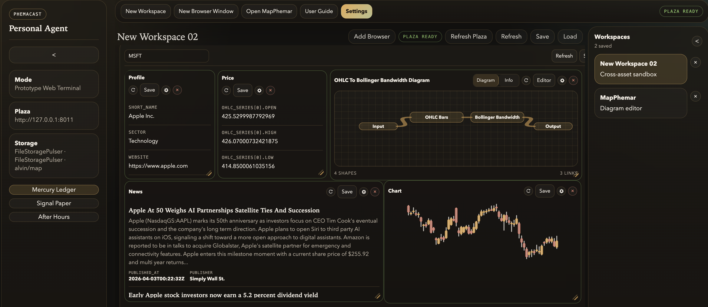
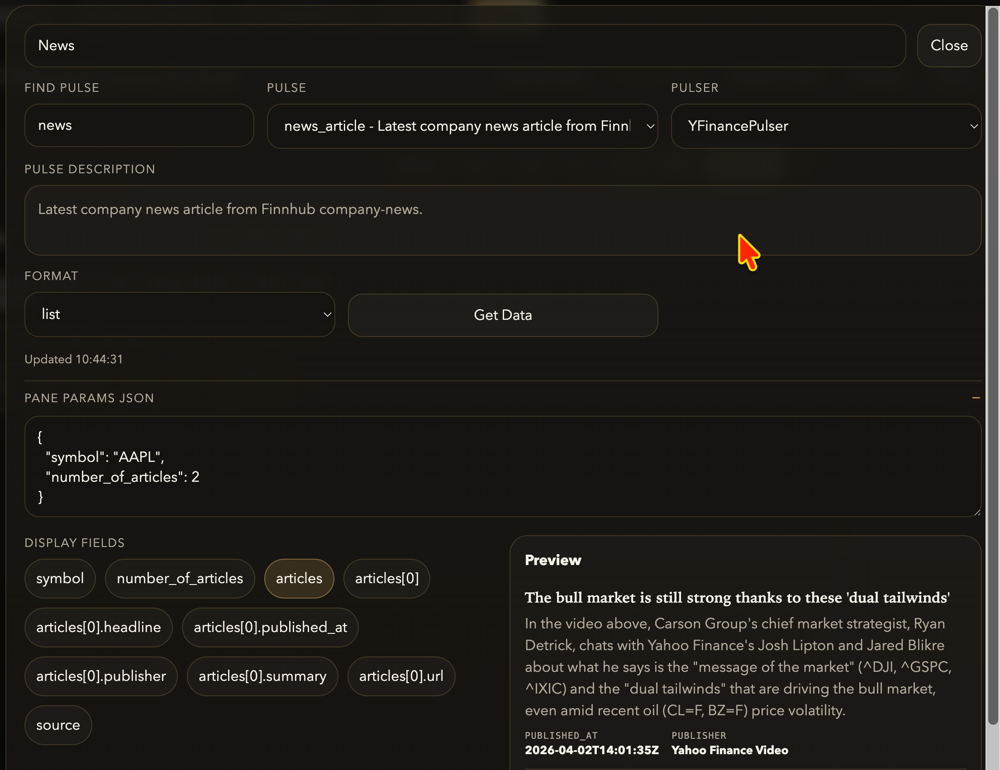
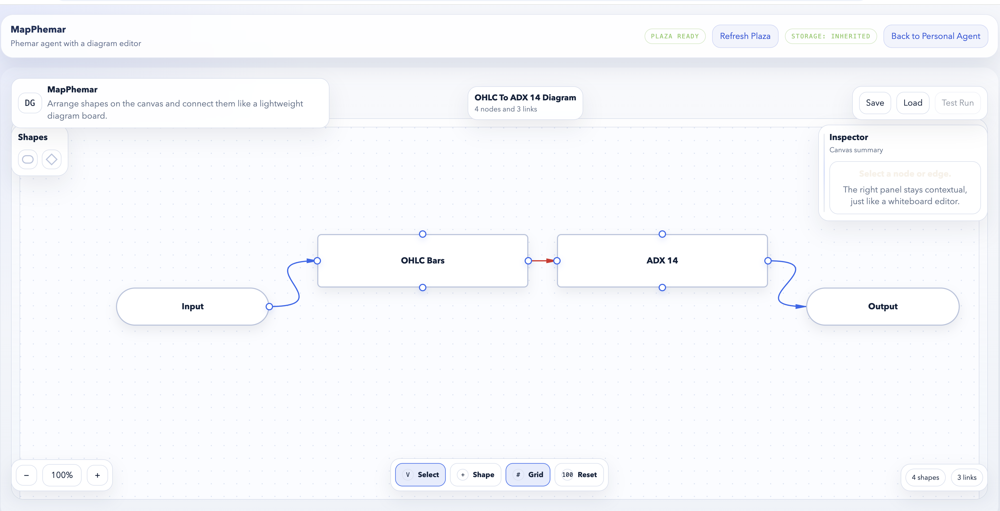
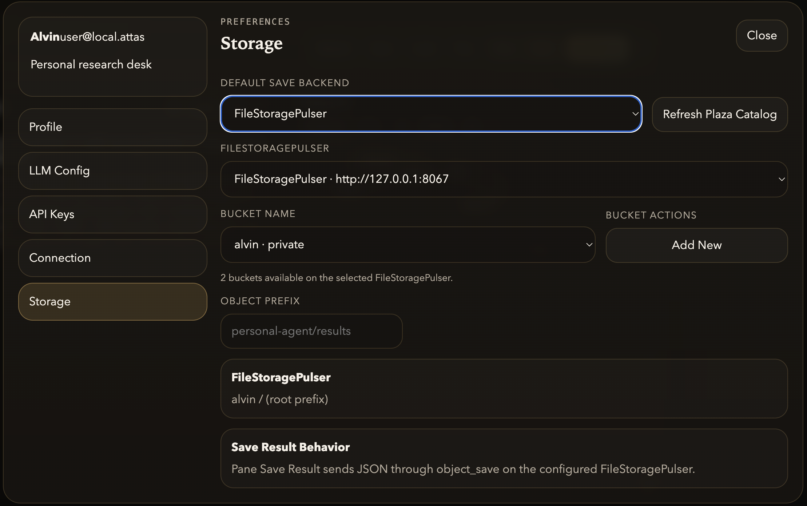

# Phemacast Personal Agent User Guide

This guide explains how to run and use the current `phemacast/personal_agent` app as it exists in this repository today.

It is written for people using the browser UI, not just developers reading the code. Where the current build mixes mocked dashboard content with live backend behavior, this guide calls that out directly.

## What The App Is

Phemacast Personal Agent is a local-first browser workspace for:

- organizing research workspaces
- opening browser windows made of reusable panes
- discovering Plaza pulsers and running pulses
- saving pane results, browser layouts, and whole workspaces
- handing diagram editing off to the integrated MapPhemar editor

Today, the app has two kinds of data:

- Sample dashboard and workspace content that is bootstrapped from local fixture data
- Live Plaza-backed catalog and pulser execution when a Plaza endpoint is available

If Plaza is unavailable, the app still loads and works in a local mock mode.

## Quick Start

From the repository root, start the app with:

```bash
uvicorn phemacast.personal_agent.app:app --reload --port 8041
```

Then open:

```text
http://127.0.0.1:8041
```

### Optional Live Plaza Connection

The default sample configuration expects Plaza at:

```text
http://127.0.0.1:8011
```

If that Plaza is running, the app can:

- refresh the Plaza catalog
- discover pulsers and supported pulses
- run pane requests through `/api/plaza/panes/run`
- expose SystemPulser options for storage-backed saving

If Plaza is not running, the status chip shows `Local Mock Mode` or `Plaza Offline`, and the sample dashboard still renders.

## Main Screen Tour

### Left Rail

The left rail shows:

- current mode
- active Plaza URL
- current storage label
- theme switcher

Available themes:

- `Mercury Ledger`
- `Signal Paper`
- `After Hours`

### Top Menu Bar

The main menu bar includes:

- `New Workspace`
- `New Browser Window`
- `Open MapPhemar`
- `Settings`
- Plaza connection status

### Workspace Canvas

The center canvas is where docked windows live. At the workspace level you can:

- rename the active workspace
- add a browser window
- refresh Plaza globally
- refresh the current workspace
- save the current workspace
- load a saved workspace

### Workspace Sidebar

The right sidebar is the workspace selector. It lets you:

- switch between saved workspaces
- collapse the workspace list into compact initials
- inspect which workspace is active

The sample bootstrap data currently includes workspaces such as `New Workspace 2`, and `MapPhemar`.



## Core Concepts

### Workspace

A workspace is the top-level container for windows, layout position, and workspace metadata.

### Browser Window

A browser window is a movable surface inside a workspace. It contains panes and has its own toolbar for symbol input, refresh, layout save/load, and dock or popup mode.

### Pane

A pane is the smallest working unit in a browser window. The current pane types are:

- `Plain`
- `Diagram`

Plain panes are for pulse results. Diagram panes preview a linked diagram, and the pane `Editor` button opens that diagram in MapPhemar.

### MapPhemar

MapPhemar is the diagram-first editor used for diagram-backed Phemas. In the Personal Agent UI, mind-map editing is now delegated to MapPhemar rather than being maintained as a full inline editor.

### Plaza

Plaza is the live catalog and execution backend. Personal Agent uses it to:

- normalize pulser catalogs
- expose practices and supported pulses
- execute pane runs
- discover compatible `SystemPulser` agents when you choose that storage backend

## Common Workflows

### 1. Create And Manage A Workspace

1. Click `New Workspace` in the top menu.
2. Rename it using the title field at the top of the workspace canvas.
3. Click `Add Browser` to add a docked browser window.
4. Use `Save` to store the current workspace layout.
5. Use `Load` to restore a previously saved workspace.

When you open the workspace save/load dialog, the app shows the current save target before you confirm the action.

### 2. Open And Use A Browser Window

Each browser window supports:

- symbol input
- Plaza refresh
- browser layout save/load
- dock or popup mode
- `view` and `edit` modes

Typical flow:

1. Enter a symbol in the toolbar.
2. Click outside the symbol field so the draft value is committed.
3. Click `Refresh` if you want to pull the latest catalog state for the window.
4. Switch to `edit` mode.
5. Click `Add Pane`.
6. Choose either `Plain` or `Diagram`.

Notes:

- `Save` and `Load` in a browser window manage pane layouts for that window.
- `Pop` opens the window externally; `Dock` brings it back into the workspace canvas.
- Pane configuration and pane deletion are available only in `edit` mode.

### 3. Configure A Plain Data Pane

For a plain pane:

1. Put the browser window in `edit` mode.
2. Click the pane config button.
3. Choose a pulser and pulse from the Plaza-backed catalog.
4. Adjust practice or pulse parameters if needed.
5. Pick a display format: `plain_text`, `json`, `list`, or `chart`.
6. If you select `chart`, choose `bar`, `line`, or `candle`.
7. Expand `Pane Params JSON` to edit request parameters directly.
8. Click `Get Data`.
9. After a successful run, optionally choose display fields from the live response.
10. Click `Save` on the pane toolbar if you want to persist the result.



What the pane toolbar actions do:

- refresh icon: reruns the pane
- `Save`: saves the current pane result to the configured default storage destination
- config icon: opens pane configuration
- `×`: deletes the pane in edit mode

### 4. Work With A Diagram Pane

Diagram panes behave differently from plain panes.

Inside a browser window, a diagram pane can:

- show a compact diagram preview
- switch between `diagram` and `info` display
- refresh linked data
- open the linked diagram in MapPhemar with `Editor`

Typical flow:

1. Add a `Diagram` pane while the browser window is in `edit` mode.
2. Use the pane toolbar to open `Editor`.
3. Build or update the linked diagram in the MapPhemar editor window that opens.
4. Return to Personal Agent and refresh the pane if needed.

If the pane has no content yet, the preview shows an empty-state prompt telling you to open the editor and start mapping ideas.

### 5. Use The Full MapPhemar Editor

You can open MapPhemar from:

- the top menu with `Open MapPhemar`
- a diagram-backed browser pane
- a dedicated diagram window bridge inside Personal Agent

Current MapPhemar capabilities exposed through this integration include:

- shape-based diagram editing
- links between shapes
- save and load diagram layouts
- save and load diagram Phemas
- run-diagram test execution with a step-by-step trace
- compatibility checks between upstream outputs and downstream inputs

The current shape preset family includes:

- rounded box
- rectangle
- pill
- note
- diamond
- branch

Important behavior:

- Personal Agent treats MapPhemar as the owner for diagram editing flows.
- Opening a diagram from Personal Agent passes return context so changes can come back to the originating workspace or pane.
- Embedded MapPhemar uses the Personal Agent storage location rather than its standalone default.



### 6. Save And Load Layouts

There are three different save/load concepts in the app:

### Workspace Save/Load

Captures the current workspace and its windows.

### Browser Layout Save/Load

Captures pane layouts for one browser window.

### Diagram Layout Save/Load

Captures diagram layouts for MapPhemar-backed diagrams.

The storage target depends on the item type:

- Workspace save/load: configured storage backend
- Browser layout save/load: configured storage backend
- Diagram layout snapshots: browser local cache (`localStorage`)

The save/load dialogs always show the effective destination before writing or reading.

### 7. Save Pane Results

Each pane can save its current result through the `Save` button in the pane header.

If the storage backend is `Local Filesystem`:

- result files are written as `.json`
- the default directory is `phemacast/personal_agent/storage/saved_files`
- you can change the directory in `Settings -> Storage`

If the storage backend is `SystemPulser`:

- the app sends JSON through the configured pulser
- you must first refresh the Plaza catalog
- then choose a compatible `SystemPulser`
- then provide a bucket name
- optionally provide an object prefix

The UI currently expects a compatible SystemPulser to support both `object_save` and `object_load`.

### 8. Configure Settings

Open `Settings` from the top menu.

The Personal Agent settings tabs are:

- `Profile`
- `Payment`
- `LLM Config`
- `API Keys`
- `Connection`
- `Storage`

### Connection Tab

Use this tab to:

- change connection mode
- edit the host value
- change the Plaza URL
- store default params JSON
- inspect Plaza connection status
- refresh the Plaza catalog

### Storage Tab

Use this tab to choose one of two backends:

- `Local Filesystem`
- `SystemPulser`

If you choose `Local Filesystem`, set a local directory.

If you choose `SystemPulser`, set:

- pulser
- bucket name
- object prefix

The storage tab also explains how the pane `Save` action behaves for the active backend.



### LLM Config Tab

This tab supports multiple stored routes. You can add:

- `API` routes
- `LLM Pulse` routes

The current implementation lets you manage route names, provider/model details, base URL, key material, temperature, and default selection.

## Persistence And Storage Details

The app stores different kinds of state in different places.

### Browser Local Storage

The following state is persisted in the browser:

- preferences
- live workspace state
- browser layout cache
- diagram layout cache
- workspace layout cache

Current keys include:

- `phemacast.personal_agent.preferences.v1`
- `phemacast.personal_agent.workspace_state.v1`
- `phemacast.personal_agent.browser_layouts.v1`
- `phemacast.personal_agent.mindmap_layouts.v1`
- `phemacast.personal_agent.workspace_layouts.v1`

### Filesystem Defaults

By default:

- pane result saves go to `phemacast/personal_agent/storage/saved_files`
- layout documents live under `phemacast/personal_agent/storage/layouts`

You can override the layout root with:

```text
PHEMACAST_PERSONAL_AGENT_LAYOUTS_PATH
```

### Embedded MapPhemar Storage

When MapPhemar is opened from Personal Agent, it inherits the configured Personal Agent storage directory.

Within that directory, MapPhemar data is organized under:

```text
<save-directory>/map_phemar/
```

That embedded storage contains the diagram config file and pool used by the MapPhemar-backed Phema workflow.

### Standalone MapPhemar Defaults

Outside Personal Agent, MapPhemar falls back to the shared `phemacast/storage` area unless you override it with:

- `PHEMACAST_MAP_PHEMAR_CONFIG_PATH`
- `PHEMACAST_MAP_PHEMAR_POOL_PATH`

## What Is Mocked Vs Live

This distinction matters when you are validating behavior.

Currently mocked:

- dashboard hero metrics
- sample watchlist, positions, analytics, and transactions
- seed workspace summaries

Currently live when a Plaza is available:

- catalog refresh
- pulser and pulse discovery
- pulser test execution
- SystemPulser-backed saving flows
- MapPhemar-backed Phema persistence routes

## Troubleshooting

### Plaza Shows `Local Mock Mode` Or `Plaza Offline`

Check that the Plaza URL in `Settings -> Connection` is correct and that the Plaza service is actually running. Then click `Refresh Plaza` or `Refresh Plaza Catalog`.

### Popup Or External Diagram Window Does Not Open

MapPhemar is opened in a popup or separate window. Allow popups for the Personal Agent origin if the browser blocks them.

### Save Or Load Fails For Workspaces Or Layouts

Check the active storage backend in `Settings -> Storage`.

For `Local Filesystem`:

- confirm the target directory is writable
- confirm the app process can create files there

For `SystemPulser`:

- refresh the Plaza catalog first
- select a SystemPulser
- set a bucket name
- confirm the pulser supports the required save and load pulses

### A Pane Will Not Run

Common causes:

- no Plaza connection
- pulser not selected
- pulse not selected
- invalid JSON in `Pane Params JSON`
- diagram nodes missing required setup

### The App Recovers But A Saved State Keeps Breaking Render

The app includes recovery handling for bad saved state, but the fastest manual reset is usually clearing the Personal Agent `localStorage` keys listed above and reloading the page.

## Useful Routes

These routes are handy when you are testing or integrating the app:

- `/`
- `/api/dashboard`
- `/api/workspaces/{workspace_id}`
- `/api/plaza/catalog`
- `/api/plaza/panes/run`
- `/api/layout-files/{layout_kind}`
- `/api/files/save/local`
- `/api/files/load/local`
- `/map-phemar`
- `/health`

## Related Docs

- [Package README](../README.md)
- [Current Feature Inventory](./current_features.md)
