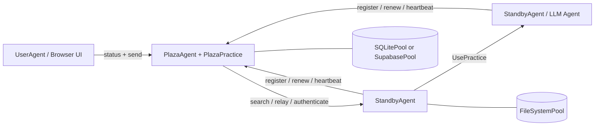

# Prompits

## Uebersetzungen

- [English](README.md)
- [繁體中文](README.zh-Hant.md)
- [简体中文](README.zh-Hans.md)
- [Español](README.es.md)
- [Français](README.fr.md)
- [Italiano](README.it.md)
- [Deutsch](README.de.md)
- [日本語](README.ja.md)
- [한국어](README.ko.md)

## Status

Prompits ist noch ein experimentelles Framework. Es eignet sich für die lokale Entwicklung, Demos, Forschungsprototypen und die Untersuchung interner Infrastrukturen. Betrachten Sie APIs, Konfigurationsstrukturen und integrierte Praktiken als in Entwicklung befindlich, bis ein eigenständiger Packaging- und Release-Flow finalisiert wurde.

## Was Prompits bietet

- Eine `BaseAgent`-Runtime, die eine FastAPI-App hostet, Practices mountet und die Plaza-Konnektivität verwaltet.
- Konkrete Agenten-Rollen für Worker-Agenten, Plaza-Koordinatoren und browserorientierte User-Agenten.
- Eine `Practice`-Abstraktion für Funktionen wie Chat, LLM-Ausführung, Embeddings, Plaza-Koordination und Pool-Operationen.
- Eine `Pool`-Abstraktion mit Filesystem-, SQLite- und Supabase-Backends.
- Eine Identitäts- und Discovery-Schicht, in der Agenten sich registrieren, authentifizieren, Token erneuern, Heartbeats senden, suchen und Nachrichten weiterleiten.
- Direkter Remote-Practice-Aufruf über `UsePractice(...)` mit Plaza-gestützter Aufruferverifizierung.

## Architektur


### Runtime-Modell

1. Jeder Agent startet eine FastAPI-App und mountet integrierte sowie konfigurierte Practices.
2. Nicht-Plaza-Agenten registrieren sich bei Plaza und erhalten:
   - eine stabile `agent_id`
   - einen persistenten `api_key`
   - ein kurzlebiges Bearer-Token für Plaza-Anfragen
3. Agenten speichern Plaza-Anmeldedaten in ihrem primären Pool und verwenden diese beim Neustart wieder.
4. Plaza führt ein durchsuchbares Verzeichnis von Agent-Cards und Liveness-Metadaten.
5. Agenten können:
   - Nachrichten an entdeckte Peers senden
   - über Plaza weiterleiten
   - eine Practice auf einem anderen Agenten mit Aufruferverifizierung aufrufen

## Kernkonzepte

### Agent

Ein Agent ist ein lang laufender Prozess mit einer HTTP-API, einem oder mehreren Practices und mindestens einem konfigurierten Pool. In der aktuellen Implementierung sind die wichtigsten konkreten Agent-Typen:

- `BaseAgent`: gemeinsame Runtime-Engine
- `StandbyAgent`: allgemeiner Worker-Agent
- `PlazaAgent`: Koordinator und Registry-Host
- `UserAgent`: browser-orientierte UI-Shell über den Plaza-APIs

### Übung

Eine Practice ist eine montierte Fähigkeit. Sie veröffentlicht Metadaten in der Agentenkarte und kann HTTP-Endpunkte sowie direkte Ausführungslogik bereitstellen.

Beispiele in diesem Repository:

- Integrierte `mailbox`: Standard-Message-Ingress für generische Agenten
- `EmbeddingsPractice`: Embedding-Generierung
- `PlazaPractice`: registrieren, erneuern, authentifizieren, suchen, heartbeat, relay
- Pool-Betriebspraktiken werden automatisch aus dem konfigurierten Pool gemountet

### Pool

Ein Pool ist die Persistenzschicht, die von Agents und Plaza verwendet wird.

- `FileSystemPool`: transparente JSON-Dateien, ideal für die lokale Entwicklung
- `SQLitePool`: Single-Node-Relational-Storage
- `SupabasePool`: gehostete Postgres/PostgREST-Integration

Der erste konfigurierte Pool ist der primäre Pool. Er wird für die Persistenz von Agenten-Anmeldedaten und Trainingsmetadaten verwendet, und zusätzliche Pools können für andere Anwendungsfälle eingebunden werden.

### Plaza

Plaza ist die Koordinationsschicht. Es ist beides:

- ein Agent-Host (`PlazaAgent`)
- ein eingebundetes Übungspaket (`PlazaPractice`)

Die Verantwortlichkeiten von Plaza umfassen:

- Identitäten der ausgebenden Agenten
- Authentifizierung von Bearer-Tokens oder gespeicherten Anmeldedaten
- Speichern durchsuchbarer Verzeichniseinträge
- Verfolgen der Heartbeat-Aktivität
- Weiterleiten von Nachrichten zwischen Agenten
- Bereitstellen von UI-Endpunkten zur Überwachung

### Nachricht und Remote-Praxis-Aufruf

Prompits unterstützt zwei Kommunikationsstile:

- Nachrichtenstil-Übermittlung an einen Peer-Practice- oder Kommunikations-Endpunkt
- Remote-Practice-Aufruf über `UsePractice(...)` und `/use_practice/{practice_id}`

Der zweite Pfad ist der strukturiertere. Der Aufrufer enthält seine `PitAddress` plus entweder einen Plaza-Token oder einen gemeinsam genutzten direkten Token. Der Empfänger verifiziert diese Identität, bevor die Practice ausgeführt wird.

Geplante `prompits`-Funktionen beinhalten:

- Stärkere, von Plaza gestützte Authentifizierungs- und Berechtigungsprüfungen für Remote-`UsePractice(...)`-Aufrufe
- Ein Workflow vor der Ausführung, bei dem Agenten Kosten aushandeln, Zahlungsbedingungen bestätigen und die Zahlung abschließen können, bevor `UsePrime(...)` ausgeführt wird
- Klarere Vertrauens- und Wirtschaftsgrenzen für die Zusammenarbeit zwischen Agenten

## Repository-Struktur
```text
prompits/
  agents/        Agent runtimes and UI templates
  core/          Core abstractions such as Pit, Practice, Pool, Plaza, Message
  pools/         FileSystem, SQLite, and Supabase pool backends
  practices/     Built-in practices such as chat, llm, embeddings, plaza
  tests/         Integration and unit tests for the runtime
  examples/      Minimal local config files for open source quickstarts

docs/
  CONCEPTS_AND_CLASSES.md   Detailed architecture and class reference
```

## Installation

Dieser Workspace führt Prompits derzeit aus dem Quellcode aus. Das einfachste Setup ist eine virtuelle Umgebung plus die direkte Installation der Abhängigkeiten.
```bash
cd /path/to/FinMAS
python3 -m venv .venv
source .venv/bin/activate
pip install --upgrade pip
pip install fastapi "uvicorn[standard]" requests httpx pydantic python-dotenv jsonschema jinja2 pytest
```

Optionale Abhängigkeiten:

- `pip install supabase`, wenn Sie `SupabasePool` verwenden möchten
- eine laufende Ollama-Instanz, wenn Sie lokale llm pulser Demos oder Embeddings verwenden möchten

## Quickstart

Die Beispielkonfigurationen in [`prompits/examples/`](./examples/README.md) sind für ein lokales Source-Checkout konzipiert und verwenden nur `FileSystemPool`.

### 1. Plaza starten
```bash
python3 prompits/create_agent.py --config prompits/examples/plaza.agent
```

Dies startet Plaza unter `http://127.0.0.1:8211`.

### 2. Einen Worker Agent starten

In einem zweiten Terminal:
```bash
python3 prompits/create_agent.py --config prompits/examples/worker.agent
```

Der Worker registriert sich beim Start automatisch bei Plaza, speichert seine Anmeldedaten dauerhaft im lokalen Dateisystem-Pool und stellt den Standard-`mailbox`-Endpunkt bereit.

### 3. Starten Sie den browserseitigen User Agent

In einem dritten Terminal:
```bash
python3 prompits/create_agent.py --config prompits/examples/user.agent
```

Öffnen Sie dann `http://127.0.0.1:8214/`, um die Plaza-Benutzeroberfläche anzuzeigen und Nachrichten über den Browser-Workflow zu senden.

### 4. Überprüfen des Stacks
```bash
curl http://127.0.0.1:8211/health
curl http://127.0.0.1:8214/api/plazas_status
```

Die zweite Anfrage sollte Plaza plus den im Verzeichnis registrierten Worker anzeigen.

## Konfiguration

Prompits-Agenten werden mit JSON-Dateien konfiguriert, meist unter Verwendung der Endung `.agent`.

### Top-Level-Felder

| Feld | Erforderlich | Beschreibung |
| --- | --- | --- |
| `name` | ja | Anzeigename und standardmäßige Agenten-Identitätsbezeichnung |
| `type` | ja | Vollqualifizierter Python-Klassenpfad für den Agenten |
| `host` | ja | Zu bindende Host-Schnittstelle |
| `port` | ja | HTTP-Port |
| `plaza_url` | nein | Plaza-Basis-URL für Nicht-Plaza-Agenten |
| `role` | nein | Rollen-String, der in der Agentenkarte verwendet wird |
| `tags` | nein | Durchsuchbare Karten-Tags |
| `agent_card` | nein | Zusätzliche Karten-Metadaten, die in die generierte Karte einfließen |
| `pools` | ja | Nicht-leere Liste der konfigurierten Pool-Backends |
| `practices` | nein | Dynamisch geladene Practice-Klassen |
| `plaza` | nein | Plaza-spezifische Optionen wie `init_files` |

### Minimales Worker-Beispiel
```json
{
  "name": "worker-a",
  "role": "worker",
  "tags": ["demo"],
  "host": "127.0.0.1",
  "port": 8212,
  "plaza_url": "http://127.0.0.1:8211",
  "pools": [
    {
      "type": "FileSystemPool",
      "name": "worker_pool",
      "description": "Worker local pool",
      "root_path": "prompits/examples/storage/worker"
    }
  ],
  "type": "prompits.agents.standby.StandbyAgent"
}
```

### Pool-Hinweise

- Eine Konfiguration muss mindestens einen Pool deklarieren.
- Der erste Pool ist der primäre Pool.
- `SupabasePool` unterstützt Umgebungsvariablen-Referenzen für `url`- und `key`-Werte durch:
  - `{ "env": "SUPABASE_SERVICE_ROLE_KEY" }`
  - `"env:SUPABASE_SERVICE_ROLE_KEY"`
  - `"${SUPABASE_SERVICE_ROLE_KEY}"`

### AgentConfig-Vertrag

- `AgentConfig` wird nicht in einer dedizierten `agent_configs`-Tabelle gespeichert.
- `AgentConfig` wird als Plaza-Verzeichniseintrag mit `type = "AgentConfig"` innerhalb von `plaza_directory` registriert.
- Gespeicherte `AgentConfig`-Payloads müssen vor der Persistierung bereinigt werden. Speichern Sie keine reinen Runtime-Felder wie `uuid`, `id`, `im`, `ip_address`, `host`, `port`, `address`, `pit_address`, `plaza_url`, `plaza_urls`, `agent_id`, `api_key` oder Bearer-Token-Felder.
- Führen Sie keine separate `agent_configs`-Tabelle oder einen Read-before-Write-Speicherfluss für `AgentConfig` wieder ein. Die Plaza-Verzeichnisregistrierung ist die vorgesehene Quelle der Wahrheit (Source of Truth).

## Integrierte HTTP-Oberfläche

### BaseAgent-Endpunkte

- `GET /health`: Liveness-Probe
- `POST /use_practice/{practice_id}`: Verifizierte Remote-Übungsausführung

### Messaging- und LLM-Pulser

- `POST /mailbox`: Standard-Endpunkt für eingehende Nachrichten, bereitgestellt von `BaseAgent`
- `GET /list_models`: Entdeckung von Anbieter-Modellen, bereitgestellt durch llm pulsers wie `OpenAIPulser`

### Plaza-Endpunkte

- `POST /register`
- `POST /renew`
- `POST /authenticate`
- `POST /heartbeat`
- `GET /search`
- `POST /relay`

Plaza dient auch:

- `GET /`
- `GET /plazas`
- `GET /api/plazas_status`
- `GET /.well-known/agent-card`

## Programmatische Nutzung

Die Tests zeigen die zuverlässigsten Beispiele für die programmatische Nutzung. Ein typischer Ablauf beim Senden einer Nachricht sieht so aus:
```python
from prompits.agents.standby import StandbyAgent

caller = StandbyAgent(
    name="caller",
    host="127.0.0.1",
    port=9001,
    plaza_url="http://127.0.0.1:8211",
    agent_card={"name": "caller", "role": "client", "tags": ["demo"]},
)

caller.register()

result = caller.send(
    "http://127.0.0.1:9002",
    {"prompt": "Return a short greeting."},
    msg_type="message",
)
```

Für eine strukturierte agentenübergreifende Ausführung verwenden Sie `UsePractice(...)` mit einer eingebundenen Practice wie `get_pulse_data` auf einem pulser.

## Entwicklung und Testen

Führen Sie die Prompits-Testsuite mit folgendem Befehl aus:
```bash
pytest prompits/tests -q
```

Nützliche Testdateien zum Lesen beim Onboarding:

- `prompts/tests/test_plaza.py`
- `prompts/tests/test_plaza_config.py`
- `prompts/tests/test_agent_pool_credentials.py`
- `prompts/tests/test_use_practice_remote_llm.py`
- `prompts/tests/test_user_ui.py`

## Open-Source-Positionierung

Im Vergleich zum früheren öffentlichen `alvincho/prompits`-Repo konzentriert sich die aktuelle Implementierung weniger auf abstrakte Terminologie und mehr auf eine ausführbare Infrastruktur-Oberfläche:

- konkrete, auf FastAPI basierende Agenten anstelle einer rein konzeptionellen Architektur
- echte Anmeldedaten-Persistenz und Plaza-Token-Erneuerung
- durchsuchbare Agenten-Karten und Relay-Verhalten
- direkte Remote-Praxisausführung mit Verifizierung
- Integrierte UI-Endpunkte für die Plaza-Inspektion

Dies macht diese Codebasis zu einer stärkeren Grundlage für eine Open-Source-Veröffentlichung, insbesondere wenn Sie Prompits präsentieren als:

- eine Infrastrukturschicht für Multi-Agenten-Systeme
- ein Framework für Entdeckung, Identität, Routing und die Ausführung von Praktiken
- eine Basis-Runtime, auf der höherwertige Agenten-Systeme aufbauen können

## Weiterführende Literatur

- [Detaillierte Konzepte und Klassennachschlag](../docs/CONCEPTS_AND_CLASSES.md)
- [Beispielkonfigurationen](./examples/README.md)
