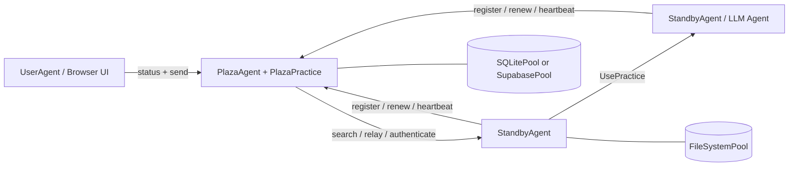

# Prompits

## Traducciones

- [English](README.md)
- [繁體中文](README.zh-Hant.md)
- [简体中文](README.zh-Hans.md)
- [Español](README.es.md)
- [Français](README.fr.md)
- [Italiano](README.it.md)
- [Deutsch](README.de.md)
- [日本語](README.ja.md)
- [한국어](README.ko.md)

## Estado

Prompits es todavía un marco experimental. Es apropiado para desarrollo local, demostraciones, prototipos de investigación y exploración de infraestructura interna. Considere las APIs, las formas de configuración y las prácticas integradas como algo en evolución hasta que se finalice un flujo de empaquetado y lanzamiento independiente.

## Qué proporciona Prompits

- Un entorno de ejecución `BaseAgent` que aloja una aplicación FastAPI, monta prácticas y gestiona la conectividad con Plaza.
- Roles de agentes concretos para agentes trabajadores, coordinadores de Plaza y agentes de usuario orientados al navegador.
- Una abstracción `Practice` para capacidades como chat, ejecución de LLM, embeddings, coordinación de Plaza y operaciones de pool.
- Una abstración `Pool` con backends de sistema de archivos, SQLite y Supabase.
- Una capa de identidad y descubrimiento donde los agentes se registran, se autentican, renuevan tokens, envían heartbeats, buscan y retransmiten mensajes.
- Invocación directa de prácticas remotas a través de `UsePractice(...)` con verificación de llamadas respaldada por Plaza.

## Arquitectura


### Modelo de tiempo de ejecución

1. Cada agente inicia una aplicación FastAPI y monta las prácticas integradas más las configuradas.
2. Los agentes que no son de Plaza se registran en Plaza y reciben:
   - un `agent_id` estable
   - una `api_key` persistente
   - un token de portador (bearer token) de corta duración para las solicitudes a Plaza
3. Los agentes persisten las credenciales de Plaza en su pool principal y las reutilizan al reiniciar.
4. Plaza mantiene un directorio searchable de tarjetas de agentes y metadatos de actividad (liveness).
5. Los agentes pueden:
   - enviar mensajes a pares descubiertos
   - realizar retransmisiones a través de Plaza
   - invocar una práctica en otro agente con verificación del llamante

## Conceptos básicos

### Agent

Un agente es un proceso de larga duración con una API HTTP, uno o más practices y al menos un pool configurado. En la implementación actual, los principales tipos de agentes concretos son:

- `BaseAgent`: motor de ejecución compartido
- `StandbyAgent`: agente de trabajo general
- `PlazaAgent`: coordinador y host del registro
- `UserAgent`: interfaz de usuario orientada al navegador sobre las APIs de Plaza

### Práctica

Una práctica es una capacidad montada. Publica metadatos en la tarjeta del agente y puede exponer puntos de enlace HTTP y lógica de ejecución directa.

Ejemplos en este repositorio:

- `mailbox` integrado: entrada de mensajes predeterminada para agentes genéricos
- `EmbeddingsPractice`: generación de embeddings
- `PlazaPractice`: registrar, renovar, autenticar, buscar, heartbeat, relay
- las prácticas de operación de pool se montan automáticamente desde el pool configurado

### Pool

Un pool es la capa de persistencia utilizada por los agentes y Plaza.

- `FileSystemPool`: archivos JSON transparentes, ideales para el desarrollo local
- `SQLitePool`: almacenamiento relacional de un solo nodo
- `SupabasePool`: integración de Postgres/PostgREST alojada

El primer pool configurado es el pool principal. Se utiliza para la persistencia de credenciales del agente y metadatos de práctica, y se pueden montar pools adicionales para otros casos de uso.

### Plaza

Plaza es el plano de coordinación. Es ambos:

- un host de agentes (`PlazaAgent`)
- un paquete de práctica montado (`PlazaPractice`)

Las responsabilidades de Plaza incluyen:

- identidades de agentes emisores
- autenticar tokens de portador (bearer tokens) o credenciales almacenadas
- almacenar entradas de directorio que se puedan buscar
- seguimiento de la actividad del latido (heartbeat)
- retransmitir mensajes entre agentes
- exponer los endpoints de la UI para el monitoreo

### Mensaje e Invocación de Práctica Remota

Prompits admite dos estilos de comunicación:

- Entrega estilo mensaje a un endpoint de práctica o comunicación de pares
- Invocación de práctica remota a través de `UsePractice(...)` y `/use_practice/{practice_id}`

La segunda ruta es la más estructurada. El llamador incluye su `PitAddress` más un token de Plaza o un token directo compartido. El receptor verifica esa identidad antes de ejecutar la práctica.

Las capacidades planificadas de `prompits` incluyen:

- Verificaciones de autenticación y permisos más sólidas respaldadas por Plaza para llamadas remotas de `UsePractice(...)`
- Un flujo de trabajo de pre-ejecución donde los agentes pueden negociar costos, confirmar términos de pago y completar el pago antes de que se ejecute `UsePractice(...)`
- Límites de confianza y económicos más claros para la colaboración entre agentes

## Estructura del repositorio
```text
prompits/
  agents/        Agent runtimes and UI templates
  core/          Core abstractions such as Pit, Practice, Pool, Plaza, Message
  pools/         FileSystem, SQLite, and Supabase pool backends
  practices/     Built-in practices such as chat, llm, embeddings, plaza
  tests/         Integration and unit tests for the runtime
  examples/      Minimal local config files for open source quickstarts

docs/
  CONCEPTS_AND_CLASSES.md   Detailed architecture and class reference
```

## Instalación

Este espacio de trabajo actualmente ejecuta Prompits desde el código fuente. La configuración más sencilla es un entorno virtual más la instalación directa de las dependencias.
```bash
cd /path/to/FinMAS
python3 -m venv .venv
source .venv/bin/activate
pip install --upgrade pip
pip install fastapi "uvicorn[standard]" requests httpx pydantic python-dotenv jsonschema jinja2 pytest
```

Dependencias opcionales:

- `pip install supabase` si desea utilizar `SupabasePool`
- una instancia de Ollama en ejecución si desea demostraciones de pulser de llm local o embeddings

## Primeros pasos

Las configuraciones de ejemplo en [`prompits/examples/`](./examples/README.md) están diseñadas para una descarga local de la fuente y utilizan únicamente `FileSystemPool`.

### 1. Iniciar Plaza
```bash
python3 prompits/create_agent.py --config prompits/examples/plaza.agent
```

Esto inicia Plaza en `http://127.0.0.1:8211`.

### 2. Iniciar un Agente Worker

En una segunda terminal:
```bash
python3 prompits/create_agent.py --config prompits/examples/worker.agent
```

El worker se registra automáticamente con Plaza al iniciar, persiste sus credenciales en el pool del sistema de archivos local y expone el endpoint `mailbox` por defecto.

### 3. Iniciar el User Agent orientado al navegador

En una tercera terminal:
```bash
python3 prompits/create_agent.py --config prompits/examples/user.agent
```

Luego, abra `http://127.0.0.1:8214/` para ver la interfaz de usuario de Plaza y enviar mensajes a través del flujo de trabajo del navegador.

### 4. Verificar el stack
```bash
curl http://127.0.0.1:8211/health
curl http://127.0.0.1:8214/api/plazas_status
```

La segunda solicitud debe mostrar Plaza más el trabajador registrado en el directorio.

## Configuración

Los agentes de Prompits se configuran con archivos JSON, generalmente utilizando el sufijo `.agent`.

### Campos de nivel superior

| Campo | Requerido | Descripción |
| --- | --- | --- |
| `name` | sí | Nombre para mostrar y etiqueta de identidad predeterminada del agente |
| `type` | sí | Ruta de clase Python totalmente calificada para el agente |
| `host` | sí | Interfaz de host a vincular |
| `port` | sí | Puerto HTTP |
| `plaza_url` | no | URL base de Plaza para agentes que no sean de Plaza |
| `role` | no | Cadena de rol utilizada en la tarjeta del agente |
| `tags` | no | Etiquetas de tarjeta buscables |
| `agent_card` | no | Metadatos adicionales de la tarjeta fusionados en la tarjeta generada |
| `pools` | sí | Lista no vacía de backends de pool configurados |
| `practices` | no | Clases de práctica cargadas dinámicamente |
| `plaza` | no | Opciones específicas de Plaza como `init_files` |

### Ejemplo mínimo de Worker
```json
{
  "name": "worker-a",
  "role": "worker",
  "tags": ["demo"],
  "host": "127.0.0.1",
  "port": 8212,
  "plaza_url": "http://127.0.0.1:8211",
  "pools": [
    {
      "type": "FileSystemPool",
      "name": "worker_pool",
      "description": "Worker local pool",
      "root_path": "prompits/examples/storage/worker"
    }
  ],
  "type": "prompits.agents.standby.StandbyAgent"
}
```

### Notas del Pool

- Una configuración debe declarar al menos un pool.
- El primer pool es el pool primario.
- `SupabasePool` admite referencias de entorno para los valores `url` y `key` a través de:
  - `{ "env": "SUPABASE_SERVICE_ROLE_KEY" }`
  - `"env:SUPABASE_SERVICE_ROLE_KEY"`
  - `"${SUPABASE_SERVICE_ROLE_KEY}"`

### Contrato AgentConfig

- `AgentConfig` no se almacena en una tabla `agent_configs` dedicada.
- `AgentConfig` se registra como una entrada de directorio de Plaza con `type = "AgentConfig"` dentro de `plaza_directory`.
- Los payloads de `AgentConfig` guardados deben ser saneados antes de la persistencia. No persista campos que sean solo de tiempo de ejecución como `uuid`, `id`, `ip`, `ip_address`, `host`, `port`, `address`, `pit_address`, `plaza_url`, `plaza_urls`, `agent_id`, `api_key` o campos de bearer-token.
- No reintroduzca una tabla `agent_configs` separada ni un flujo de guardado de lectura previa a la escritura para `AgentConfig`. El registro en el directorio de Plaza es la fuente de verdad prevista.

## Superficie HTTP Integrada

### Endpoints de BaseAgent

- `GET /health`: sonda de liveness
- `POST /use_practice/{practice_id}`: ejecución de práctica remota verificada

### Pulsers de Mensajería y LLM

- `POST /mailbox`: endpoint de mensajes entrantes predeterminado montado por `BaseAgent`
- `GET /list_models`: descubrimiento de modelos de proveedor expuesto por llm pulsers como `OpenAIPulser`

### Endpoints de Plaza

- `POST /register`
- `POST /renew`
- `POST /authenticate`
- `POST /heartbeat`
- `GET /search`
- `POST /relay`

Plaza también sirve:

- `GET /`
- `GET /plazas`
- `GET /api/plazas_status`
- `GET /.well-known/agent-card`

## Uso programático

Las pruebas muestran los ejemplos más fiables de uso programático. Un flujo típico de envío de mensajes se ve así:
```python
from prompits.agents.standby import StandbyAgent

caller = StandbyAgent(
    name="caller",
    host="127.0.0.1",
    port=9001,
    plaza_url="http://127.0.0.1:8211",
    agent_card={"name": "caller", "role": "client", "tags": ["demo"]},
)

caller.register()

result = caller.send(
    "http://127.0.0.1:9002",
    {"prompt": "Return a short greeting."},
    msg_type="message",
)
```

Para una ejecución estructurada entre agentes, utilice `UsePractice(...)` con una práctica montada como `get_pulse_data` en un pulser.

## Desarrollo y pruebas

Ejecuta la suite de pruebas de Prompits con:
```bash
pytest prompits/tests -q
```

Archivos de prueba útiles para leer durante el onboarding:

- `prompits/tests/test_plaza.py`
- `prompits/tests/test_plaza_config.py`
- `prompits/tests/test_agent_pool_credentials.py`
- `prompits/tests/test_use_practice_remote_llm.py`
- `prompits/tests/test_user_ui.py`

## Posicionamiento de código abierto

En comparación con el repositorio público anterior `alvincho/prompits`, la implementación actual se centra menos en la terminología abstracta y más en una superficie de infraestructura ejecutable:

- agentes concretos basados en FastAPI en lugar de una arquitectura solo conceptual
- persistencia de credenciales reales y renovación de tokens de Plaza
- tarjetas de agentes buscables y comportamiento de retransmisión
- ejecución de práctica remota directa con verificación
- endpoints de UI integrados para la inspección de Plaza

Esto hace que esta base de código sea una base más sólida para un lanzamiento de código abierto, especialmente si presenta Prompits como:

- una capa de infraestructura para sistemas multi-agente
- un marco de trabajo para el descubrimiento, la identidad, el enrutamiento y la ejecución de prácticas
- un entorno de ejecución base sobre el cual pueden construirse sistemas de agentes de nivel superior

## Lectura adicional

- [Conceptos detallados y referencia de clases](../docs/CONCEPTS_AND_CLASSES.md)
- [Ejemplos de configuración](./examples/README.md)
