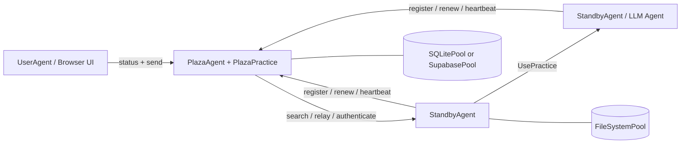

# Prompits

## Traductions

- [English](README.md)
- [繁體中文](README.zh-Hant.md)
- [简体中文](README.zh-Hans.md)
- [Español](README.es.md)
- [Français](README.fr.md)
- [Italiano](README.it.md)
- [Deutsch](README.de.md)
- [日本語](README.ja.md)
- [한국어](README.ko.md)

## État

Prompits est encore un framework expérimental. Il est approprié pour le développement local, les démos, les prototypes de recherche et l'exploration d'infrastructure interne. Considérez les API, les formes de configuration et les pratiques intégrées comme étant en évolution jusqu'à ce qu'un flux de packaging et de publication autonome soit finalisé.

## Ce que fournit Prompits

- Un runtime `BaseAgent` qui héberge une application FastAPI, monte des pratiques et gère la connectivité Plaza.
- Des rôles d'agents concrets pour les agents travailleurs, les coordinateurs Plaza et les agents utilisateurs orientés navigateur.
- Une abstraction `Practice` pour des capacités telles que le chat, l'exécution de LLM, les embeddings, la coordination Plaza et les opérations de pool.
- Une abstraction `Pool` avec des backends filesystem, SQLite et Supabase.
- Une couche d'identité et de découverte où les agents s'enregistrent, s'authentifient, renouvellent les jetons, envoient des heartbeats, recherchent et relayent des messages.
- Invocation directe de pratiques distantes via `UsePractice(...)` avec vérification de l'appelant via Plaza.

## Architecture


### Modèle d'exécution

1. Chaque agent démarre une application FastAPI et monte les pratiques intégrées ainsi que les pratiques configurées.
2. Les agents non-Plaza s'enregistrent auprès de Plaza et reçoivent :
   - un `agent_id` stable
   - une `api_key` persistante
   - un jeton porteur (bearer token) à courte durée de vie pour les requêtes Plaza
3. Les agents persistent les identifiants Plaza dans leur pool principal et les réutilisent au redémarrage.
4. Plaza maintient un répertoire consultable de cartes d'agents et de métadonnées de présence (liveness).
5. Les agents peuvent :
   - envoyer des messages aux pairs découverts
   - effectuer un relais via Plaza
   - invoquer une pratique sur un autre agent avec vérification de l'appelant

## Concepts fondamentaux

### Agent

Un agent est un processus de longue durée doté d'une API HTTP, d'un ou plusieurs practices et d'au moins un pool configuré. Dans l'implémentation actuelle, les principaux types d'agents concrets sont :

- `BaseAgent` : moteur d'exécution partagé
- `StandbyAgent` : agent de travail général
- `PlazaAgent` : coordinateur et hôte du registre
- `UserAgent` : interface utilisateur orientée navigateur sur les API de Plaza

### Pratique

Une pratique est une capacité montée. Elle publie des métadonnées dans la fiche de l'agent et peut exposer des points de terminaison HTTP et une logique d'exécution directe.

Exemples dans ce dépôt :

- `mailbox` intégré : entrée de messages par défaut pour les agents génériques
- `EmbeddingsPractice`: génération d'embeddings
- `PlazaPractice` : s'enregistrer, renouveler, s'authentifier, rechercher, heartbeat, relay
- les pratiques d'opération de pool sont montées automatiquement à partir du pool configuré

### Pool

Un pool est la couche de persistance utilisée par les agents et Plaza.

- `FileSystemPool` : fichiers JSON transparents, parfaits pour le développement local
- `SQLitePool` : stockage relationnel à nœud unique
- `SupabasePool` : intégration Postgres/PostgREST hébergée

Le premier pool configuré est le pool principal. Il est utilisé pour la persistance des identifiants de l'agent et les métadonnées d'entraînement, et d'autres pools peuvent être montés pour d'autres cas d'utilisation.

### Plaza

Plaza est le plan de coordination. Il est à la fois :

- un hôte d'agent (`PlazaAgent`)
- un bundle de pratique monté (`PlazaPractice`)

Les responsabilités de Plaza incluent :

- identités des agents émetteurs
- authentification des tokens bearer ou des identifiants stockés
- stockage d'entrées de répertoire consultables
- suivi de l'activité du battement de cœur (heartbeat)
- transmettre des messages entre les agents
- exposer les points de terminaison de l'UI pour la surveillance

### Message et invocation de pratique à distance

Prompits prend en charge deux styles de communication :

- Livraison de style message à un point de terminaison de pratique ou de communication entre pairs
- Invocation de pratique à distance via `UsePractice(...)` et `/use_practice/{practice_id}`

La deuxième voie est la plus structurée. L'appelant inclut son `PitAddress` ainsi qu'un jeton Plaza ou un jeton direct partagé. Le destinataire vérifie cette identité avant d'exécuter la pratique.

Les capacités prévues de `prompits` incluent :

- Des contrôles d'authentification et de permission plus robustes, basés sur Plaza, pour les appels `UsePractice(...)` à distance
- Un flux de travail de pré-exécution où les agents peuvent négocier les coûts, confirmer les conditions de paiement et effectuer le paiement avant l'exécution de `UsePractice(...)`
- Des limites de confiance et économiques plus claires pour la collaboration entre agents

## Structure du dépôt
```text
prompits/
  agents/        Agent runtimes and UI templates
  core/          Core abstractions such as Pit, Practice, Pool, Plaza, Message
  pools/         FileSystem, SQLite, and Supabase pool backends
  practices/     Built-in practices such as chat, llm, embeddings, plaza
  tests/         Integration and unit tests for the runtime
  examples/      Minimal local config files for open source quickstarts

docs/
  CONCEPTS_AND_CLASSES.md   Detailed architecture and class reference
```

## Installation

Cet espace de travail exécute actuellement Prompits à partir des sources. La configuration la plus simple consiste en un environnement virtuel plus l'installation directe des dépendances.
```bash
cd /path/to/FinMAS
python3 -m venv .venv
source .venv/bin/activate
pip install --upgrade pip
pip install fastapi "uvicorn[standard]" requests httpx pydantic python-dotenv jsonschema jinja2 pytest
```

Dépendances optionnelles :

- `pip install supabase` si vous souhaitez utiliser `SupabasePool`
- une instance Ollama en cours d'exécution si vous souhaitez des démos de pulser llm local ou des embeddings

## Démarrage rapide

Les configurations d'exemple dans [`prompits/examples/`](./examples/README.md) sont conçues pour une extraction locale de la source et utilisent uniquement `FileSystemPool`.

### 1. Démarrer Plaza
```bash
python3 prompits/create_agent.py --config prompits/examples/plaza.agent
```

Ceci lance Plaza sur `http://127.0.0.1:8211`.

### 2. Démarrer un Agent Worker

Dans un second terminal :
```bash
python3 prompits/create_agent.py --config prompits/examples/worker.agent
```

Le worker s'enregistre automatiquement auprès de Plaza au démarrage, persiste ses identifiants dans le pool du système de fichiers local et expose l'endpoint `mailbox` par défaut.

### 3. Démarrer l'User Agent orienté navigateur

Dans un troisième terminal :
```bash
python3 prompits/create_agent.py --config prompits/examples/user.agent
```

Ensuite, ouvrez `http://127.0.0.1:8214/` pour afficher l'interface utilisateur de Plaza et envoyer des messages via le flux de travail du navigateur.

### 4. Vérifier la pile
```bash
curl http://127.0.0.1:8211/health
curl http://127.0.0.1:8214/api/plazas_status
```

La deuxième requête doit afficher Plaza ainsi que l'agent enregistré dans le répertoire.

## Configuration

Les agents Prompits sont configurés avec des fichiers JSON, utilisant généralement le suffixe `.agent`.

### Champs de haut niveau

| Champ | Requis | Description |
| --- | --- | --- |
| `name` | oui | Nom d'affichage et étiquette d'identité par défaut de l'agent |
| `type` | oui | Chemin de classe Python complet pour l'agent |
| `host` | oui | Interface hôte à lier |
| `port` | oui | Port HTTP |
| `plaza_url` | non | URL de base Plaza pour les agents non-Plaza |
| `role` | non | Chaîne de rôle utilisée dans la fiche de l'agent |
| `tags` | non | Tags de fiche recherchables |
| `agent_card` | non | Métadonnées de fiche supplémentaires fusionnées dans la fiche générée |
| `pools` | oui | Liste non vide des backends de pool configurés |
| `practices` | non | Classes de pratique chargées dynamiquement |
| `plaza` | non | Options spécifiques à Plaza telles que `init_files` |

### Exemple de Worker minimal
```json
{
  "name": "worker-a",
  "role": "worker",
  "tags": ["demo"],
  "host": "127.0.0.1",
  "port": 8212,
  "plaza_url": "http://127.0.0.1:8211",
  "pools": [
    {
      "type": "FileSystemPool",
      "name": "worker_pool",
      "description": "Worker local pool",
      "root_path": "prompits/examples/storage/worker"
    }
  ],
  "type": "prompits.agents.standby.StandbyAgent"
}
```

### Notes du Pool

- Une configuration doit déclarer au moins un pool.
- Le premier pool est le pool primaire.
- `SupabasePool` prend en charge les références d'environnement pour les valeurs `url` et `key` via :
  - `{ "env": "SUPABASE_SERVICE_ROLE_KEY" }`
  - `"env:SUPABASE_SERVICE_ROLE_KEY"`
  - `"${SUPABASE_SERVICE_ROLE_KEY}"`

### Contrat AgentConfig

- `AgentConfig` n'est pas stocké dans une table `agent_configs` dédiée.
- `AgentConfig` est enregistré comme une entrée du répertoire Plaza avec `type = "Agent_Config"` à l'intérieur de `plaza_directory`.
- Les payloads `AgentConfig` sauvegardés doivent être nettoyés avant la persistance. Ne persistez pas les champs uniquement disponibles au runtime tels que `uuid`, `id`, `ip`, `ip_address`, `host`, `port`, `address`, `pit_address`, `plaza_url`, `plaza_urls`, `agent_id`, `api_key` ou les champs bearer-token.
- Ne réintroduisez pas de table `agent_configs` séparée ou de flux de sauvegarde de type lecture-avant-écriture pour `AgentConfig`. L'enregistrement dans le répertoire Plaza est la source de vérité prévue.

## Surface HTTP Intégrée

### Endpoints BaseAgent

- `GET /health`: sonde de liveness
- `POST /use_practice/{practice_id}`: exécution de pratique à distance vérifiée

### Pulsers de Messagerie et LLM

- `POST /mailbox`: endpoint de messages entrants par défaut monté par `BaseAgent`
- `GET /list_models`: découverte de modèles de fournisseur exposée par les llm pulsers tels que `OpenAIPulser`

### Endpoints Plaza

- `POST /register`
- `POST /renew`
- `POST /authenticate`
- `POST /heartbeat`
- `GET /search`
- `POST /relay`

Plaza sert également :

- `GET /`
- `GET /plazas`
- `GET /api/plazas_status`
- `GET /.well-known/agent-card`

## Utilisation programmatique

Les tests montrent les exemples les plus fiables d'utilisation programmatique. Un flux typique d'envoi de message ressemble à ceci :
```python
from prompits.agents.standby import StandbyAgent

caller = StandbyAgent(
    name="caller",
    host="127.0.0.1",
    port=9001,
    plaza_url="http://127.0.0.1:8211",
    agent_card={"name": "caller", "role": "client", "tags": ["demo"]},
)

caller.register()

result = caller.send(
    "http://127.0.0.1:9002",
    {"prompt": "Return a short greeting."},
    msg_type="message",
)
```

Pour une exécution structurée entre agents, utilisez `UsePractice(...)` avec une pratique montée telle que `get_pulse_data` sur un pulser.

## Développement et tests

Exécutez la suite de tests de Prompits avec :
```bash
pytest prompits/tests -q
```

Fichiers de test utiles à lire lors de l'onboarding :

- `prompts/tests/test_plaza.py`
- `prompts/tests/test_plaza_config.py`
- `prompts/tests/test_agent_pool_credentials.py`
- `prompts/tests/test_use_practice_remote_llm.py`
- `prompts/tests/test_user_ui.py`

## Positionnement Open Source

Par rapport à l'ancien dépôt public `alvincho/prompits`, l'implémentation actuelle porte moins sur la terminologie abstraite et davantage sur une surface d'infrastructure exécutable :

- des agents concrets basés sur FastAPI plutôt qu'une architecture uniquement conceptuelle
- persistance des identifiants réels et renouvellement du jeton Plaza
- cartes d'agents consultables et comportement de relais
- exécution de pratique à distance directe avec vérification
- points de terminaison UI intégrés pour l'inspection de Plaza

Cela fait de cette base de code une base plus solide pour une publication en open source, surtout si vous présentez Prompits comme :

- une couche d'infrastructure pour les systèmes multi-agents
- un framework pour la découverte, l'identité, le routage et l'exécution de pratiques
- un environnement d'exécution de base sur lequel des systèmes d'agents de plus haut niveau peuvent être construits

## Lecture complémentaire

- [Concepts détaillés et référence des classes](../docs/CONCEPTS_AND_CLASSES.md)
- [Exemples de configurations](./examples/README.md)
