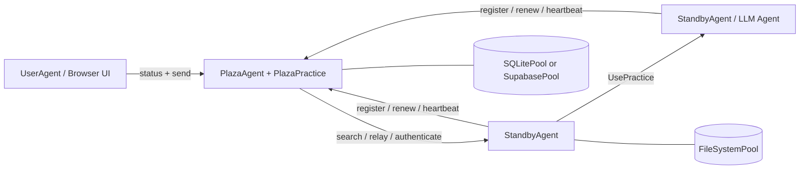

# Prompits

## Traduzioni

- [English](README.md)
- [繁體中文](README.zh-Hant.md)
- [简体中文](README.zh-Hans.md)
- [Español](README.es.md)
- [Français](README.fr.md)
- [Italiano](README.it.md)
- [Deutsch](README.de.md)
- [日本語](README.ja.md)
- [한국어](README.ko.md)

## Stato

Prompits è ancora un framework sperimentale. È appropriato per lo sviluppo locale, demo, prototipi di ricerca ed esplorazione di infrastrutture interne. Considera le API, le forme di configurazione e le pratiche integrate come in evoluzione finché non verrà finalizzato un flusso di packaging e rilascio indipendente.

## Cosa fornisce Prompits

- Un runtime `BaseAgent` che ospita un'app FastAPI, monta le pratiche e gestisce la connettività a Plaza.
- Ruoli agent concreti per agent worker, coordinatori Plaza e agent user orientati al browser.
- Un'astrazione `Practice` per funzionalità quali chat, esecuzione di LLM, embedding, coordinamento Plaza e operazioni di pool.
- Un'astrazione `Pool` con backend filesystem, SQLite e Supiente.
- Uno strato di identità e scoperta in cui gli agent registrano, si autenticano, rinnovano i token, inviano heartbeat, cercano e inoltrano messaggi.
- Invocazione diretta di pratiche remote tramite `UsePractice(...)` con verifica del chiamante supportata da Plaza.

## Architettura


### Modello di runtime

1. Ogni agente avvia un'app FastAPI e monta le pratiche integrate più quelle configurate.
2. Gli agenti non-Plaza si registrano presso Plaza e ricevono:
   - un `agent_id` stabile
   capa
   - una `api_key` persistente
   - un bearer token a breve durata per le richieste a Plaza
3. Gli agenti persistono le credenziali Plaza nel loro pool principale e le riutilizzano al riavvio.
4. Plaza mantiene un elenco consultabile di schede degli agenti e metadati di liveness.
5. Gli agenti possono:
   - inviare messaggi ai peer scoperti
   - inoltrare tramite Plaza
   - invocare una pratica su un altro agente con verifica del chiamante

## Concetti fondamentali

### Agent

Un agente è un processo a lunga esecuzione con un'API HTTP, uno o più practice e almeno un pool configurato. Nell'attuale implementazione, i principali tipi di agenti concreti sono:

- `BaseAgent`: motore di runtime condiviso
- `StandbyAgent`: agente di lavoro generico
- `PlazaAgent`: coordinatore e host del registro
- `UserAgent`: interfaccia utente rivolta al browser sopra le API di Plaza

### Esercitazione

Una pratica è una capacità montata. Pubblica metadati nella scheda dell'agente e può esporre endpoint HTTP e logica di esecuzione diretta.

Esempi in questo repository:

- `mailbox` integrato: ingresso predefinito dei messaggi per agenti generici
- `EmbeddingsPractice`: generazione di embedding
- `PlazaPractice`: registra, rinnova, autentica, cerca, heartbeat, relay
- le pratiche di operazione del pool vengono montate automaticamente dal pool configurato

### Pool

Un pool è lo strato di persistenza utilizzato dagli agenti e da Plaza.

- `FileSystemPool`: file JSON trasparenti, ottimi per lo sviluppo locale
- `SQLitePool`: storage relazionale a nodo singolo
- `SupabasePool`: integrazione Postgres/PostgREST ospitata

Il primo pool configurato è il pool primario. Viene utilizzato per la persistenza delle credenziali dell'agente e i metadati di pratica, e altri pool possono essere montati per altri casi d'uso.

### Plaza

Plaza è il piano di coordinamento. È entrambi:

- un host di agent (`PlazaAgent`)
- un pacchetto di pratica montato (`PlazaPractice`)

Le responsabilità di Plaza includono:

- identità degli agenti emittenti
- autenticazione di bearer token o credenziali memorizzate
- memorizzazione di voci di directory ricercabili
- monitoraggio dell'attività heartbeat
- inoltrare messaggi tra gli agenti
- esporre gli endpoint dell'UI per il monitoraggio

### Messaggio e invocazione della pratica remota

Prompits supporta due stili di comunicazione:

heavy-duty
- Consegna in stile messaggio a un endpoint di pratica o di comunicazione tra pari
- Invocazione di pratica remota tramite `UsePractice(...)` e `/use_practice/{practice_id}`

Il secondo percorso è quello più strutturato. Il chiamante include il proprio `PitAddress` più un token Plaza o un token diretto condiviso. Il ricevente verifica l'identità prima di eseguire la pratica.

Le funzionalità pianificate di `prompits` includono:

- Controlli di autenticazione e autorizzazione più forti supportati da Plaza per le chiamate remote `Use

## Struttura del repository
```text
prompits/
  agents/        Agent runtimes and UI templates
  core/          Core abstractions such as Pit, Practice, Pool, Plaza, Message
  pools/         FileSystem, SQLite, and Supabase pool backends
  practices/     Built-in practices such as chat, llm, embeddings, plaza
  tests/         Integration and unit tests for the runtime
  examples/      Minimal local config files for open source quickstarts

docs/
  CONCEPTS_AND_CLASSES.md   Detailed architecture and class reference
```

## Installazione

Questo workspace attualmente esegue Prompits dal sorgente. La configurazione più semplice è un ambiente virtuale più l'installazione diretta delle dipendenze.
```bash
cd /path/to/FinMAS
python3 -m venv .venv
source .venv/bin/activate
pip install --upgrade pip
pip install fastapi "uvicorn[standard]" requests httpx pydantic python-dotenv jsonschema jinja2 pytest
```

Dipendenze opzionali:

- `pip install supabase` se desideri utilizzare `SupabasePool`
- un'istanza Ollama in esecuzione se desideri demo di pulser llm locale o embedding

## Avvio rapido

Le configurazioni di esempio in [`prompits/examples/`](./examples/README.md) sono progettate per un checkout locale della sorgente e utilizzano solo `FileSystemPool`.

### 1. Avvia Plaza
```bash
python3 prompits/create_agent.py --config prompits/examples/plaza.agent
```

Questo avvia Plaza su `http://127.0.0.1:8211`.

### 2. Avvia un Agente Worker

In un secondo terminale:
```bash
python3 prompits/create_agent.py --config prompits/examples/worker.agent
```

Il worker si registra automaticamente con Plaza all'avvio, persiste le proprie credenziali nel pool del file system locale ed espone l'endpoint `mailbox` predefinito.

### 3. Avviare l'User Agent rivolto al browser

In un terzo terminale:
```bash
python3 prompits/create_agent.py --config prompits/examples/user.agent
```

Quindi apri `http://127.0.0.1:8214/` per visualizzare l'interfaccia utente di Plaza e inviare messaggi tramite il workflow del browser.

### 4. Verifica lo stack
```bash
curl http://127.0.0.1:8211/health
curl http://127.0.0.1:8214/api/plazas_status
```

La seconda richiesta dovrebbe mostrare Plaza più il worker registrato nella directory.

## Configurazione

Gli agenti di Prompits sono configurati con file JSON, solitamente utilizzando il suffisso `.agent`.

### Campi di alto livello

| Campo | Richiesto | Descrizione |
| --- | --- | --- |
| `name` | sì | Nome visualizzato e etichetta di identità predefinita dell'agente |
| `type` | sì | Percorso della classe Python completo per l'agente |
| `host` | sì | Interfaccia host da collegare |
| `port` | sì | Porta HTTP |
| `plaza_url` | no | URL base di Plaza per agenti non-Plaza |
| `role` | no | Stringa del ruolo utilizzata nella scheda dell'agente |
| `tags` | no | Tag della scheda ricercabili |
| `agent_card` | no | Metadati aggiuntivi della scheda incorporati nella scheda generata |
| `pools` | sì | Elenco non vuoto di backend di pool configurati |
| `practices` | no | Classi di pratica caricate dinamicamente |
| `plaza` | no | Opzioni specifiche di Plaza come `init_files` |

### Esempio minimo di Worker
```json
{
  "name": "worker-a",
  "role": "worker",
  "tags": ["demo"],
  "host": "127.0.0.1",
  "port": 8212,
  "plaza_url": "http://127.0.0.1:8211",
  "pools": [
    {
      "type": "FileSystemPool",
      "name": "worker_pool",
      "description": "Worker local pool",
      "root_path": "prompits/examples/storage/worker"
    }
  ],
  "type": "prompits.agents.standby.StandbyAgent"
}
```

### Note del Pool

- Una configurazione deve dichiarare almeno un pool.
- Il primo pool è il pool primario.
- `SupabasePool` supporta riferimenti all'ambiente per i valori `url` e `key` tramite:
  - `{ "env": "SUPABASE_SERVICE_ROLE_KEY" }`
  - `"env:SUPABASE_SERVICE_ROLE_KEY"`
  - `"${SUPABASE_SERVICE_ROLE_KEY}"`

### Contratto AgentConfig

- `AgentConfig` non è memorizzato in una tabella dedicata `agent_configs`.
- `AgentConfig` è registrato come voce nel directory di Plaza con `type = "AgentConfig"` all'interno di `plaza_directory`.
- I payload di `AgentConfig` salvati devono essere sanificati prima della persistenza. Non persistere campi solo runtime come `uuid`, `id`, `ip`, `ip_address`, `host`, `port`, `address`, `pit_address`, `plaza_url`, `plaza_urls`, `agent_id`, `api_key` o campi bearer-token.
- Non reintrodurre una tabella `agent_configs` separata o un flusso di salvataggio read-before-write per `AgentConfig`. La registrazione nel directory di Plaza è la fonte di verità prevista.

## Superficie HTTP Integrata

### Endpoint di BaseAgent

- `GET /health`: sonda di liveness
- `POST /use_practice/{practice_id}`: esecuzione di pratica remota verificata

### Pulsers di Messaggistica e LLM

- `POST /mailbox`: endpoint predefinito per i messaggi in entrata montato da `BaseAgent`
- `GET /list_models`: scoperta dei modelli del provider esposta da llm pulsers come `OpenAIPulser`

### Endpoint di Plaza

- `POST /register`
- `POST /renew`
- `POST /authenticate`
- `POST /heartbeat`
- `GET /search`
- `POST /relay`

Plaza serve anche:

- `GET /`
- `GET /plazas`
- `GET /api/plazas_status`
- `GET /.well-known/agent-card`

## Utilizzo programmatico

I test mostrano gli esempi più affidabili di utilizzo programmatico. Un tipico flusso di invio di messaggi è il seguente:
```python
from prompits.agents.standby import StandbyAgent

caller = StandbyAgent(
    name="caller",
    host="127.0.0.1",
    port=9001,
    plaza_url="http://127.0.0.1:8211",
    agent_card={"name": "caller", "role": "client", "tags": ["demo"]},
)

caller.register()

result = caller.send(
    "http://127.0.0.1:9002",
    {"prompt": "Return a short greeting."},
    msg_type="message",
)
```

Per un'esecuzione strutturata tra agent, utilizza `UsePractice(...)` con una pratica montata come `get_pulse_data` su un pulser.

## Sviluppo e test

Esegui la suite di test di Prompits con:
```bash
pytest prompits/tests -q
```

File di test utili da leggere durante l'onboarding:

- `prompts/tests/test_plaza.py`
- `prompts/tests/test_plaza_config.py`
- `prompts/tests/test_agent_pool_credentials.py`
- `prompts/tests/test_use_practice_remote_llm.py`
- `prompts/tests/test_user_ui.py`

## Posizionamento Open Source

Rispetto al precedente repository pubblico `alvincho/prompits`, l'attuale implementazione si concentra meno sulla terminologia astratta e più su una superficie di infrastruttura eseguibile:

- agent concreti basati su FastAPI invece di un'architettura solo concettuale
- persistenza delle credenziali reali e rinnovo del token Plaza
- schede agenti ricercabili e comportamento di relay
- esecuzione di pratica remota diretta con verifica
- endpoint UI integrati per l'ispezione di Plaza

Ciò rende questa base di codice una base più solida per un rilascio open source, specialmente se presenti Prompits come:

- uno strato di infrastruttura per sistemi multi-agente
- un framework per la scoperta, l'identità, il routing e l'esecuzione di pratiche
- un runtime di base su cui possono essere costruiti sistemi di agenti di livello superiore

## Ulteriori letture

- [Concetti dettagliati e riferimento alle classi](../docs/CONCEPTS_AND_CLASSES.md)
- [Esempi di configurazioni](./examples/README.md)
