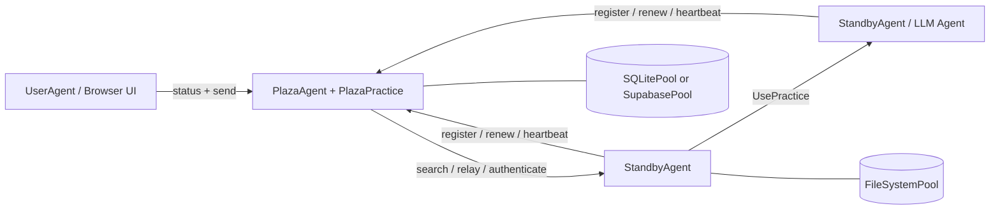

# Prompits

## 翻訳版

- [English](README.md)
- [繁體中文](README.zh-Hant.md)
- [简体中文](README.zh-Hans.md)
- [Español](README.es.md)
- [Français](README.fr.md)
- [Italiano](README.it.md)
- [Deutsch](README.de.md)
- [日本語](README.ja.md)
- [한국어](README.ko.md)

## ステータス

Prompits はまだ実験的なフレームワークです。ローカル開発、デモ、研究用プロトタイプ、および内部インフラストラクチャの探索に適しています。スタンドアロンのパッケージングおよびリリースフローが確定するまでは、API、設定の形式、および組み込みの慣行は進化の過程にあるものとして扱ってください。

## Prompits が提供するもの

- FastAPI アプリをホストし、practice をマウントし、Plaza への接続を管理する `BaseAgent` ランタイム。
- ワーカーエージェント、Plaza コーディネーター、およびブラウザ向けユーザーエージェントのための具体的なエージェントロール。
- チャット、LLM 実行、embeddings、Plaza 調整、および pool 操作などの機能のための `Practice` 抽象化。
- ファイルシステム、SQLite、および Supabase バックエンドを備えた `Pool` 抽象化。
- エージェントが登録、認証、トークン更新、ハートビート、検索、メッセージ転送を行う ID およびディスカバリー層。
- Plaza による呼び出し者検証を備えた `UsePractice(...)` による直接的なリモート practice の呼び出し。

## アーキテクチャ


### ランタイムモデル

1. 各エージェントは FastAPI アプリを起動し、組み込みおよび設定済みの practice をマウントします。
2. 非 Plaza エージェントは Plaza に登録し、以下を受け取ります：
   - 安定した `agent_id`
   - 持続的な `api_key`
   - Plaza リクエスト用の短寿命の bearer token
3. エージェントは Plaza の認証情報をプライマリプールに永続化し、再起動時に再利用します。
4. Plaza は、エージェントカードと生存（liveness）メタデータの検索可能なディレクトリを維持します。
5. エージェントは以下のことが可能です：
   - 発見されたピアにメッセージを送信する
   - Plaza を介してリレーする
   - 呼び出し元検証を伴う、別のエージェント上の practice を呼び出す

## コアコンセプト

### Agent

エージェントは、HTTP API、1つまたは複数の practice、および少なくとも1つの設定済み pool を持つ長時間実行プロセスです。現在の実装では、主な具体的なエージェントのタイプは以下の通りです：

- `BaseAgent`: 共有ランタイムエンジン
- `StandbyAgent`: 一般的なワーカーエージェント
- `PlazaAgent`: コーディネーターおよびレジストリホスト
- `UserAgent`: Plaza APIs 上で動作するブラウザ向け UI シェル

### 練習

Practiceはマウントされた機能です。エージェントカードにメタデータを公開し、HTTPエンドポイントや直接的な実行ロジックを公開できます。

このリポジトリの例：

- 内蔵 `mailbox`: 一般的なエージェント用のデフォルトのメッセージイングレス
- `EmbeddingsPractice`: エンベディング生成
- `PlazaPractice`: 登録、更新、認証、検索、ハートビート、リレー
- 設定されたプールから自動的にマウントされるプール操作の実践

### プール

プールは、agents と Plaza で使用される永続化レイヤーです。

- `FileSystemPool`: 透明なJSONファイル、ローカル開発に最適
- `SQLitePool`: シングルノードのリレーショナルストレージ
- `SupabasePool`: ホストされた Postgres/PostgREST 統合

最初に設定されたプールはプライマリプールです。これはエージェントの資格情報の永続化と練習のメタデータに使用され、他のユースケースのために追加のプールをマウントすることもできます。

### Plaza

Plaza は調整平面です。それは以下の両方です：

- エージェントホスト (`PlazaAgent`)
- マウントされた練習用バンドル (`PlazaPractice`)

Plaza の責任には以下が含まれます：

- 発行エージェントの識別情報
- bearer tokens または保存された認証情報の認証
- 検索可能なディレクトリエントリの保存
- ハートビート活動の追跡
- エージェント間でメッセージを中継する
- モニタリング用の UI エンドポイントを公開する

### メッセージとリモートプラクティスの呼び出し

Prompits は 2 つの通信スタイルをサポートしています：

- ピアの練習または通信エンドポイントへのメッセージスタイルの配信
- `UsePractice(...)` および `/use_practice/{practice_id}` を介したリモート練習の呼び出し

2番目のパスは、より構造化されたものです。呼び出し元は、自身の `PitAddress` に加えて、Plaza トークンまたは共有の直接トークンのいずれかを含めます。受信側は、練習を実行する前にその身元を検証します。

計画されている `prompits` の機能には以下が含まれます：

- リモートの `UsePractice(...)` 呼び出しに対する、Plaza に裏打ちされたより強力な認証および権限チェック
- エージェントが `UsePractice(...)` の実行前に、コストの交渉、支払い条件の確認、および支払いの完了を行える実行前ワークフロー
- エージェント間コラボレーションのための、より明確な信頼および経済的境界

## リポジトリの構成
```text
prompits/
  agents/        Agent runtimes and UI templates
  core/          Core abstractions such as Pit, Practice, Pool, Plaza, Message
  pools/         FileSystem, SQLite, and Supabase pool backends
  practices/     Built-in practices such as chat, llm, embeddings, plaza
  tests/         Integration and unit tests for the runtime
  examples/      Minimal local config files for open source quickstarts

docs/
  CONCEPTS_AND_CLASSES.md   Detailed architecture and class reference
```

## インストール

このワークスペースは、現在 Prompits をソースから実行しています。最も簡単なセットアップは、仮想環境と依存関係の直接インストールです。
```bash
cd /path/to/FinMAS
python3 -m venv .venv
source .venv/bin/activate
pip install --upgrade pip
pip install fastapi "uvicorn[standard]" requests httpx pydantic python-dotenv jsonschema jinja2 pytest
```

オプションの依存関係：

- `SupabasePool` を使用する場合は `pip install supabase`
- ローカルの llm pulser デモや埋め込み（embeddings）を使用する場合は、実行中の Ollama インスタンスが必要です

## クイックスタート

[`prompits/examples/`](./examples/README.md) の例示設定は、ローカルソースのチェックアウト用に設計されており、`FileSystemPool` のみを使用します。

### 1. Plaza の起動
```bash
python3 prompits/create_agent.py --config prompits/examples/plaza.agent
```

これにより `http://127.0.0.1:8211` で Plaza が起動します。

### 2. Worker Agent の起動

2 つ目のターミナルで：
```bash
python3 prompits/create_agent.py --config prompits/examples/worker.agent
```

Worker は起動時に Plaza に自動的に登録され、認証情報をローカルファイルシステムのプールに永続化し、デフォルトの `mailbox` エンドポイントを公開します。

### 3. ブラウザ向け User Agent の起動

3 番目のターミナルで：
```bash
python3 prompits/create_agent.py --config prompits/examples/user.agent
```

次に `http://127.0.0.1:8214/` を開いて Plaza UI を表示し、ブラウザのワークフローを通じてメッセージを送信します。

### 4. スタックの検証
```bash
curl http://127.0.0.1:8211/health
curl http://127.0.0.1:8214/api/plazas_status
```

2番目のリクエストには、Plazaとディレクトリに登録されているワーカーが表示される必要があります。

## 設定

Prompits エージェントは JSON ファイルで設定され、通常は `.agent` サフィックスを使用します。

### トップレベルフィールド

| フィールド | 必須 | 説明 |
| --- | --- | --- |
| `name` | はい | 表示名およびデフォルトのエージェント識別ラベル |
| `type` | はい | エージェントの完全修飾 Python クラスパス |
| `host` | はい | バインドするホストインターフェース |
| `port` | はい | HTTP ポート |
| `plaza_url` | いいえ | 非 Plaza エージェント用の Plaza ベース URL |
| `role` | いいえ | エージェントカードで使用されるロール文字列 |
| `tags` | いいえ | 検索可能なカードタグ |
| `agent_card` | いいえ | 生成されたカードにマージされる追加のカードメタデータ |
| `pools` | はい | 設定されたプールバックエンドの空でないリスト |
| `practices` | いいえ | 動的にロードされる practice クラス |
| `plaza` | いいえ | `init_files` などの Plaza 特有のオプション |

### 最小限の Worker 例
```json
{
  "name": "worker-a",
  "role": "worker",
  "tags": ["demo"],
  "host": "127.0.0.1",
  "port": 8212,
  "plaza_url": "http://127.0.0.1:8211",
  "pools": [
    {
      "type": "FileSystemPool",
      "name": "worker_pool",
      "description": "Worker local pool",
      "root_path": "prompits/examples/storage/worker"
    }
  ],
  "type": "prompits.agents.standby.StandbyAgent"
}
```

### プールに関する注意

- 設定には少なくとも1つのプールを宣言する必要があります。
- 最初のプールがプライマリプールとなります。
- `SupabasePool` は、以下のいずれかの方法で `url` および `key` 値の環境変数参照をサポートしています：
  - `{ "env": "SUPABASE_SERVICE_ROLE_KEY" }`
  - `"env:SUPABASE_SERVICE_ROLE_KEY"`
  - `"${SUPABASE_SERVICE_ROLE_KEY}"`

### AgentConfig コントラクト

- `AgentConfig` は専用の `agent_configs` テーブルには保存されません。
- `AgentConfig` は、`plaza_directory` 内に `type = "AgentConfig"` として Plaza ディレクトリのエントリとして登録されます。
- 保存される `AgentConfig` ペイロードは、永続化の前にサニタイズされる必要があります。`uuid`、`id`、`ip`、`ip_address`、`host`、`port`、`address`、`pit_address`、`plaza_url`、`plaza_urls`、`agent_id`、`api_key`、または bearer-token フィールドなどの実行時のみ使用されるフィールドは永続化しないでください。
- `AgentConfig` に対して、別途 `agent_configs` テーブルを導入したり、書き込み前の読み取り（read-before-write）保存フローを導入したりしないでください。Plaza ディレクトリへの登録が意図された信頼できる唯一の情報源（source of truth）です。

## 内蔵 HTTP サーフェス

### BaseAgent エンドポイント

- `GET /health`: ライブネスプローブ (liveness probe)
- `POST /use_practice/{practice_id}`: 検証済みのリモート練習の実行

### メッセージングおよび LLM Pulsers

- `POST /mailbox`: `BaseAgent` によってマウントされたデフォルトの受信メッセージ エンドポイント
- `GET /list_models`: `OpenAIPulser` などの llm pulsers によって公開されるプロバイダー モデルの検出

### Plaza エンドポイント

- `POST /register`
- `POST /renew`
- `POST /authenticate`
- `POST /heartbeat`
- `GET /search`
- `POST /relay`

Plaza は以下も提供します：

- `GET /`
- `GET /plazas`
- `GET /api/plazas_status`
- `GET /.well-known/agent-card`

## プログラムによる使用法

テストでは、プログラムによる使用法の最も信頼できる例が示されています。典型的なメッセージ送信フローは次のようになります。
```python
from prompits.agents.standby import StandbyAgent

caller = StandbyAgent(
    name="caller",
    host="127.0.0.1",
    port=9001,
    plaza_url="http://127.0.0.1:8211",
    agent_card={"name": "caller", "role": "client", "tags": ["demo"]},
)

caller.register()

result = caller.send(
    "http://127.0.0.1:9002",
    {"prompt": "Return a short greeting."},
    msg_type="message",
)
```

構造化されたエージェント間実行には、pulser 上の `get_pulse_data` のようなマウントされた practice を使用して `UsePractice(...)` を使用します。

## 開発とテスト

Prompits テストスイートを次のコマンドで実行します：
```bash
pytest prompits/tests -q
```

オンボーディング時に読むと役立つテストファイル：

- `prompts/tests/test_plaza.py`
- `prompts/tests/test_plaza_config.py`
- `prompts/tests/test_agent_pool_credentials.py`
- `prompts/tests/test_use_practice_remote_llm.py`
- `prompts/tests/test_user_ui.py`

## オープンソースのポジショニング

以前の公開リポジトリ `alvincho/prompits` と比較して、現在の実装は抽象的な用語よりも、実行可能なインフラストラクチャのサーフェスに重点を置いています：

- 概念のみのアーキテクチャではなく、FastAPIに基づいた具体的なエージェント
- 実際の認証情報の永続化と Plaza トークンの更新
- 検索可能なエージェントカードとリレー動作
- 検証を伴う直接的なリモート実践実行
- Plaza の検査用の組み込み UI エンドポイント

これにより、このコードベースはオープンソースとしてリリースするためのより強力な基盤となります。特に、Prompitsを次のように提示する場合にその傾向が強まります：

- マルチエージェントシステムのためのインフラストラクチャ層
- 発見、アイデンティティ、ルーティング、および実践の実行のためのフレームワーク
- 高レベルのエージェントシステムがその上に構築できるベースのランタイム

## 関連情報

- [詳細な概念とクラスリファレンス](../docs/CONCEPTS_AND_CLASSES.md)
- [設定例](./examples/README.md)
