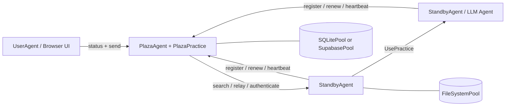

# Prompits

## 번역본

- [English](README.md)
- [繁體中文](README.zh-Hant.md)
- [简体中文](README.zh-Hans.md)
- [Español](README.es.md)
- [Français](README.fr.md)
- [Italiano](README.it.md)
- [Deutsch](README.de.md)
- [日本語](README.ja.md)
- [한국어](README.ko.md)

## 상태

Prompits는 아직 실험적인 프레임워크입니다. 로컬 개발, 데모, 연구 프로토타입 및 내부 인프라 탐색에 적합합니다. 독립적인 패키징 및 릴리스 흐름이 확정될 때까지 API, 구성 형태 및 내장된 관행은 계속 진화하는 것으로 간주하십시오.

## Prompits가 제공하는 기능

- FastAPI 앱을 호스트하고, practices를 마운트하며, Plaza 연결을 관리하는 `BaseAgent` 런타임.
- 워커 에이전트, Plaza 코디네이터 및 브라우저용 사용자 에이전트를 위한 구체적인 에이전트 역할.
- 채팅, LLM 실행, 임베딩, Plaza 조정 및 pool 작업과 같은 기능을 위한 `Practice` 추상화.
- 파일 시스템, SQLite 및 Supabase 백엔드를 포함하는 `Pool` 추상화.
- 에이전트가 등록, 인증, 토큰 갱신, 하트비트, 검색 및 메시지 전달을 수행하는 ID 및 디스커버리 계층.
- Plaza 기반 호출자 검증을 통한 `UsePractice(...)`를 이용한 직접적인 원격 practice 호출.

## 아키텍처


### 런타임 모델

1. 각 에이전트는 FastAPI 앱을 시작하고 내장된 기능 및 구성된 practice를 마운트합니다.
2. Non-Plaza 에이전트는 Plaza에 등록하여 다음을 수신합니다:
   - 안정적인 `agent_id`
   - 지속적인 `api_key`
   - Plaza 요청을 위한 단기 bearer token
3. 에이전트는 Plaza 자격 증명을 기본 풀에 영구 저장하고 재시작 시 재사용합니다.
4. Plaza는 에이전트 카드 및 liveness 메타데이터의 검색 가능한 디렉토리를 유지합니다.
5. 에이전트는 다음을 수행할 수 있습니다:
   - 발견된 피어에게 메시지 전송
   - Plaza를 통한 중계
   - 호출자 검증을 통한 다른 에이전트의 practice 호출

## 핵심 개념

### Agent

에이전트는 HTTP API, 하나 이상의 practice, 그리고 최소 하나의 구성된 pool을 가진 장기 실행 프로세스입니다. 현재 구현에서 주요한 구체적인 에이전트 유형은 다음과 같습니다:

- `BaseAgent`: 공유 런타임 엔진
- `StandbyAgent`: 일반 작업 에이전트
- `PlazaAgent`: 코디네이터 및 레지스트리 호스트
- `UserAgent`: Plaza APIs 상에서 동작하는 브라우저용 UI 셸

### 연습

Practice는 마운트된 기능입니다. 에이전트 카드에 메타데이터를 게시하고 HTTP 엔드포인트 및 직접 실행 로직을 노출할 수 있습니다.

이 저장소의 예시:

- 내장 `mailbox`: 일반 에이전트를 위한 기본 메시지 인그레스
- `EmbeddingsPractice`: 임베딩 생성
- `PlazaPractice`: 등록, 갱신, 인증, 검색, 하트비트, 릴레이
- 구성된 풀에서 자동으로 마운트되는 풀 작업 관행

### 풀

풀은 agents와 Plaza에서 사용하는 지속성 계층입니다.

- `FileSystemPool`: 투명한 JSON 파일, 로컬 개발에 매우 적합합니다
- `SQLitePool`: 단일 노드 관계형 저장소
- `SupabasePool`: 호스팅된 Postgres/PostgREST 통합

처음으로 구성된 풀은 기본 풀입니다. 이는 에이전트 자격 증명 지속성 및 연습 메타데이터에 사용되며, 다른 사용 사례를 위해 추가 풀을 마운트할 수 있습니다.

### Plaza

Plaza는 조정 평면입니다. 이는 다음 두 가지 모두에 해당합니다:

- 에이전트 호스트 (`PlazaAgent`)
- 마운트된 연습용 번들 (`PlazaPractice`)

Plaza의 책임에는 다음이 포함됩니다:

- 발행 대리인 식별 정보
- bearer tokens 또는 저장된 자격 증명 인증
- 검색 가능한 디렉터리 항목 저장
- 하트비트 활동 추적
- 에이전트 간에 메시지 전달
- 모니터링을 위한 UI 엔드포인트 노출

### 메시지 및 원격 연습 호출

Prompits는 두 가지 통신 스타일을 지원합니다:

- 피어 연습 또는 통신 엔드포인트로 메시지 스타일 전달
- `UsePractice(...)` 및 `/use_practice/{practice_id}`를 통한 원격 연습 호출

두 번째 경로는 더 구조화된 방식입니다. 호출자는 자신의 `PitAddress`와 Plaza 토큰 또는 공유된 직접 토큰을 포함합니다. 수신자는 연습을 실행하기 전에 해당 신원을 확인합니다.

계획된 `prompits` 기능에는 다음이 포함됩니다:

- 원격 `UsePractice(...)` 호출에 대해 Plaza가 지원하는 더 강력한 인증 및 권한 확인
- 에이전트가 `UsePractice(...)`가 실행되기 전에 비용을 협상하고, 결제 조건을 확인하며, 결제를 완료할 수 있는 실행 전 워크플로우
- 에이전트 간 협업을 위한 더 명확한 신뢰 및 경제적 경계

## 저장소 구조
```text
prompits/
  agents/        Agent runtimes and UI templates
  core/          Core abstractions such as Pit, Practice, Pool, Plaza, Message
  pools/         FileSystem, SQLite, and Supabase pool backends
  practices/     Built-in practices such as chat, llm, embeddings, plaza
  tests/         Integration and unit tests for the runtime
  examples/      Minimal local config files for open source quickstarts

docs/
  CONCEPTS_AND_CLASSES.md   Detailed architecture and class reference
```

## 설치

이 워크스페이스는 현재 소스에서 Prompits를 실행합니다. 가장 간단한 설정은 가상 환경과 직접적인 의존성 설치입니다.
```bash
cd /path/to/FinMAS
python3 -m venv .venv
source .venv/bin/activate
pip install --upgrade pip
pip install fastapi "uvicorn[standard]" requests httpx pydantic python-dotenv jsonschema jinja2 pytest
```

선택적 의존성:

- `SupabasePool`을 사용하려면 `pip install supabase`를 설치하세요
- 로컬 llm pulser 데모 또는 임베딩(embeddings)을 사용하려면 실행 중인 Ollama 인스턴스가 필요합니다

## 빠른 시작

[`prompits/examples/`](./examples/README.md)의 예제 설정은 로컬 소스 체크아웃을 위해 설계되었으며 `FileSystemPool`만 사용합니다.

### 1. Plaza 시작
```bash
python3 prompits/create_agent.py --config prompits/examples/plaza.agent
```

이 명령은 `http://127.0.0.1:8211`에서 Plaza를 시작합니다.

### 2. Worker Agent 시작하기

두 번째 터미널에서:
```bash
python3 prompits/create_agent.py --config prompits/examples/worker.agent
```

Worker는 시작 시 Plaza에 자동으로 등록되며, 로컬 파일 시스템 풀에 자격 증명을 유지하고 기본 `mailbox` 엔드포인트를 노출합니다.

### 3. 브라우저용 User Agent 시작

세 번째 터미널에서:
```bash
python3 prompits/create_agent.py --config prompits/examples/user.agent
```

그 다음 `http://127.0.0.1:8214/`를 열어 Plaza UI를 확인하고 브라우저 워크플로를 통해 메시지를 전송합니다.

### 4. 스택 검증
```bash
curl http://127.0.0.1:8211/health
curl http://127.0.0.1:8214/api/plazas_status
```

두 번째 요청에는 Plaza와 디렉토리에 등록된 작업자가 표시되어야 합니다.

## 설정

Prompits 에이전트는 JSON 파일로 구성되며, 일반적으로 `.agent` 접미사를 사용합니다.

### 최상위 필드

| 필드 | 필수 여부 | 설명 |
| --- | --- | --- |
| `name` | 예 | 표시 이름 및 기본 에이전트 식별 레이블 |
| `type` | 예 | 에이전트를 위한 전체 경로 Python 클래스 경로 |
| `host` | 예 | 바인딩할 호스트 인터페이스 |
| `port` | 예 | HTTP 포트 |
| `plaza_url` | 아니요 | 비 Plaza 에이전트를 위한 Plaza 기본 URL |
| `role` | 아니요 | 에이전트 카드에 사용되는 역할 문자열 |
| `tags` | 아니요 | 검색 가능한 카드 태그 |
| `agent_card` | 아니요 | 생성된 카드에 병합되는 추가 카드 메타데이터 |
| `pools` | 예 | 구성된 풀 백엔드의 비어 있지 않은 목록 |
| `practices` | 아니요 | 동적으로 로드되는 practice 클래스 |
| `plaza` | 아니요 | `init_files`와 같은 Plaza 전용 옵션 |

### 최소 Worker 예시
```json
{
  "name": "worker-a",
  "role": "worker",
  "tags": ["demo"],
  "host": "127.0.0.1",
  "port": 8212,
  "plaza_url": "http://127.0.0.1:8211",
  "pools": [
    {
      "type": "FileSystemPool",
      "name": "worker_pool",
      "description": "Worker local pool",
      "root_path": "prompits/examples/storage/worker"
    }
  ],
  "type": "prompits.agents.standby.StandbyAgent"
}
```

### 풀 노트

- 설정에는 최소 하나 이상의 풀을 선언해야 합니다.
- 첫 번째 풀이 기본 풀입니다.
- `SupabasePool`은 다음 중 하나를 통해 `url` 및 `key` 값에 대한 환경 변수 참조를 지원합니다:
  - `{ "env": "SUPABASE_SERVICE_ROLE_KEY" }`
  - `"env:SUPABASE_SERVICE_ROLE_KEY"`
  - `"${SUPABASE_SERVICE_ROLE_KEY}"`

### AgentConfig 계약

- `AgentConfig`는 별도의 `agent_configs` 테이블에 저장되지 않습니다.
- `AgentConfig`는 `plaza_directory` 내에 `type = "AgentConfig"`로 Plaza 디렉토리 엔트리로 등록됩니다.
- 저장된 `AgentConfig` 페이로드는 영속화 전에 정화(sanitize)되어야 합니다. `uuid`, `id`, `ip`, `ip_address`, `host`, `port`, `address`, `pit_address`, `plaza_url`, `plaza_urls`, `agent_id`, `api_key` 또는 bearer-token 필드와 같이 런타임 전용 필드는 영속화하지 마십시오.
- `AgentConfig`를 위해 별도의 `agent_configs` 테이블이나 read-before-write 저장 흐름을 다시 도입하지 마십시오. Plaza 디렉토리 등록이 의도된 단일 진실 공급원(source of truth)입니다.

## 내장 HTTP 서피스

### BaseAgent 엔드포인트

- `GET /health`: liveness probe
- `POST /use_practice/{practice_id}`: 검증된 원격 연습 실행

### 메시징 및 LLM Pulsers

- `POST /mailbox`: `BaseAgent`에 의해 마운트된 기본 인바운드 메시지 엔드포인트
- `GET /list_models`: `OpenAIPulser`와 같은 llm pulsers에 의해 노출되는 제공업체 모델 검색

### Plaza 엔드포인트

- `POST /register`
- `POST /renew`
- `POST /authenticate`
- `POST /heartbeat`
- `GET /search`
- `POST /relay`

Plaza는 다음 기능도 제공합니다:

- `GET /`
- `GET /plazas`
- `GET /api/plazas_status`
- `GET /.well-known/agent-card`

## 프로그래밍 방식 사용법

테스트를 통해 프로그래밍 방식 사용의 가장 신뢰할 수 있는 예시를 확인할 수 있습니다. 전형적인 메시지 전송 흐름은 다음과 같습니다:
```python
from prompits.agents.standby import StandbyAgent

caller = StandbyAgent(
    name="caller",
    host="127.0.0.1",
    port=9001,
    plaza_url="http://127.0.0.1:8211",
    agent_card={"name": "caller", "role": "client", "tags": ["demo"]},
)

caller.register()

result = caller.send(
    "http://127.0.0.1:9002",
    {"prompt": "Return a short greeting."},
    msg_type="message",
)
```

구조화된 에이전트 간 실행을 위해, pulser의 `get_pulse_data`와 같이 마운트된 practice를 사용하여 `UsePractice(...)`를 사용하십시오.

## 개발 및 테스트

다음 명령으로 Prompits 테스트 스위트를 실행하세요:
```bash
pytest prompits/tests -q
```

온보딩 시 읽어보면 유용한 테스트 파일:

- `prompts/tests/test_plaza.py`
- `prompts/tests/test_plaza_config.py`
- `prompts/tests/test_agent_pool_credentials.py`
- `prompts/tests/test_use_practice_remote_llm.py`
- `prompts/tests/test_user_ui.py`

## 오픈 소스 포지셔닝

이전의 공개 `alvincho/prompits` 리포지토리와 비교하여, 현재의 구현은 추상적인 용어보다는 실행 가능한 인프라 표면에 더 가깝습니다:

- 개념적인 아키텍처가 아닌 FastAPI 기반의 구체적인 에이전트
- 실제 자격 증명 지속성 및 Plaza 토큰 갱신
- 검색 가능한 에이전트 카드 및 릴레이 동작
- 검증을 포함한 직접적인 원격 실습 실행
- Plaza 검사를 위한 내장 UI 엔드포인트

이는 이 코드베이스를 오픈 소스 출시를 위한 더 강력한 기반으로 만들어 주며, 특히 Prompits를 다음과 같이 제시할 경우 더욱 그러합니다:

- 멀티 에이전트 시스템을 위한 인프라 계층
- 발견, 식별, 라우팅 및 실행을 위한 프레임워크
- 상위 수준의 에이전트 시스템이 그 위에 구축할 수 있는 기본 런타임

## 추가 읽기 자료

- [상세 개념 및 클래스 참조](../docs/CONCEPTS_AND_CLASSES.md)
- [설정 예시](./examples/README.md)
