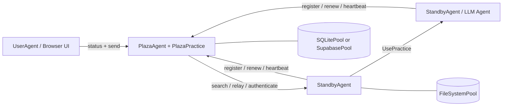

# Prompits

Prompits is a Python infrastructure layer for building networked, multi-agent systems. It gives each agent a FastAPI runtime, a pool-backed local memory, a registry/discovery service called Plaza, and a practice model for mounting capabilities that can be called locally or across agents.

The older public [`alvincho/prompits`](https://github.com/alvincho/prompits) repository introduced the decentralized multi-agent vision. The implementation in this workspace keeps that direction, but the current code is much more concrete: HTTP-native agents, Plaza-issued identities and tokens, persisted credentials, searchable agent cards, remote `UsePractice` calls, and optional UI surfaces for monitoring and interaction.

## Status

Prompits is still an experimental framework. It is appropriate for local development, demos, research prototypes, and internal infrastructure exploration. Treat APIs, config shapes, and built-in practices as evolving until a standalone packaging and release flow is finalized.

## What Prompits Provides

- A `BaseAgent` runtime that hosts a FastAPI app, mounts practices, and manages Plaza connectivity.
- Concrete agent roles for worker agents, Plaza coordinators, and browser-facing user agents.
- A `Practice` abstraction for capabilities such as chat, LLM execution, embeddings, Plaza coordination, and pool operations.
- A `Pool` abstraction with filesystem, SQLite, and Supabase backends.
- An identity and discovery layer where agents register, authenticate, renew tokens, heartbeat, search, and relay messages.
- Direct remote practice invocation through `UsePractice(...)` with Plaza-backed caller verification.

## Architecture



### Runtime Model

1. Each agent starts a FastAPI app and mounts built-in plus configured practices.
2. Non-Plaza agents register with Plaza and receive:
   - a stable `agent_id`
   - a persistent `api_key`
   - a short-lived bearer token for Plaza requests
3. Agents persist Plaza credentials to their primary pool and reuse them on restart.
4. Plaza maintains a searchable directory of agent cards and liveness metadata.
5. Agents can:
   - send messages to discovered peers
   - relay through Plaza
   - invoke a practice on another agent with caller verification

## Core Concepts

### Agent

An agent is a long-running process with an HTTP API, one or more practices, and at least one configured pool. In the current implementation, the main concrete agent types are:

- `BaseAgent`: shared runtime engine
- `StandbyAgent`: general worker agent
- `PlazaAgent`: coordinator and registry host
- `UserAgent`: browser-facing UI shell over Plaza APIs

### Practice

A practice is a mounted capability. It publishes metadata into the agent card and can expose HTTP endpoints and direct execution logic.

Examples in this repository:

- built-in `mailbox`: default message ingress for generic agents
- `EmbeddingsPractice`: embedding generation
- `PlazaPractice`: register, renew, authenticate, search, heartbeat, relay
- pool operation practices auto-mounted from the configured pool

### Pool

A pool is the persistence layer used by agents and Plaza.

- `FileSystemPool`: transparent JSON files, great for local development
- `SQLitePool`: single-node relational storage
- `SupabasePool`: hosted Postgres/PostgREST integration

The first configured pool is the primary pool. It is used for agent credential persistence and practice metadata, and additional pools can be mounted for other use cases.

### Plaza

Plaza is the coordination plane. It is both:

- an agent host (`PlazaAgent`)
- a mounted practice bundle (`PlazaPractice`)

Plaza responsibilities include:

- issuing agent identities
- authenticating bearer tokens or stored credentials
- storing searchable directory entries
- tracking heartbeat activity
- relaying messages between agents
- exposing UI endpoints for monitoring

### Message and Remote Practice Invocation

Prompits supports two communication styles:

- Message-style delivery to a peer practice or communication endpoint
- Remote practice invocation through `UsePractice(...)` and `/use_practice/{practice_id}`

The second path is the more structured one. The caller includes its `PitAddress` plus either a Plaza token or a shared direct token. The receiver verifies that identity before executing the practice.

Planned `prompits` capabilities include:

- stronger Plaza-backed authentication and permission checks for remote
  `UsePractice(...)` calls
- a pre-execution workflow where agents can negotiate cost, confirm payment terms,
  and complete payment before `UsePractice(...)` runs
- clearer trust and economic boundaries for cross-agent collaboration

## Repository Layout

```text
prompits/
  agents/        Agent runtimes and UI templates
  core/          Core abstractions such as Pit, Practice, Pool, Plaza, Message
  pools/         FileSystem, SQLite, and Supabase pool backends
  practices/     Built-in practices such as chat, llm, embeddings, plaza
  tests/         Integration and unit tests for the runtime
  examples/      Minimal local config files for open source quickstarts

docs/
  CONCEPTS_AND_CLASSES.md   Detailed architecture and class reference
```

## Installation

This workspace currently runs Prompits from source. The simplest setup is a virtual environment plus direct dependency installation.

```bash
cd /path/to/FinMAS
python3 -m venv .venv
source .venv/bin/activate
pip install --upgrade pip
pip install fastapi "uvicorn[standard]" requests httpx pydantic python-dotenv jsonschema jinja2 pytest
```

Optional dependencies:

- `pip install supabase` if you want to use `SupabasePool`
- a running Ollama instance if you want local llm pulser demos or embeddings

## Quickstart

The example configs in [`prompits/examples/`](./examples/README.md) are designed for a local source checkout and use only `FileSystemPool`.

### 1. Start Plaza

```bash
python3 prompits/create_agent.py --config prompits/examples/plaza.agent
```

This starts Plaza on `http://127.0.0.1:8211`.

### 2. Start a Worker Agent

In a second terminal:

```bash
python3 prompits/create_agent.py --config prompits/examples/worker.agent
```

The worker auto-registers with Plaza on startup, persists its credentials in the local filesystem pool, and exposes the default `mailbox` endpoint.

### 3. Start the Browser-Facing User Agent

In a third terminal:

```bash
python3 prompits/create_agent.py --config prompits/examples/user.agent
```

Then open `http://127.0.0.1:8214/` to view the Plaza UI and send messages through the browser workflow.

### 4. Verify the Stack

```bash
curl http://127.0.0.1:8211/health
curl http://127.0.0.1:8214/api/plazas_status
```

The second request should show Plaza plus the registered worker in the directory.

## Configuration

Prompits agents are configured with JSON files, usually using the `.agent` suffix.

### Top-Level Fields

| Field | Required | Description |
| --- | --- | --- |
| `name` | yes | Display name and default agent identity label |
| `type` | yes | Fully-qualified Python class path for the agent |
| `host` | yes | Host interface to bind |
| `port` | yes | HTTP port |
| `plaza_url` | no | Plaza base URL for non-Plaza agents |
| `role` | no | Role string used in the agent card |
| `tags` | no | Searchable card tags |
| `agent_card` | no | Additional card metadata merged into the generated card |
| `pools` | yes | Non-empty list of configured pool backends |
| `practices` | no | Dynamically loaded practice classes |
| `plaza` | no | Plaza-specific options such as `init_files` |

### Minimal Worker Example

```json
{
  "name": "worker-a",
  "role": "worker",
  "tags": ["demo"],
  "host": "127.0.0.1",
  "port": 8212,
  "plaza_url": "http://127.0.0.1:8211",
  "pools": [
    {
      "type": "FileSystemPool",
      "name": "worker_pool",
      "description": "Worker local pool",
      "root_path": "prompits/examples/storage/worker"
    }
  ],
  "type": "prompits.agents.standby.StandbyAgent"
}
```

### Pool Notes

- A config must declare at least one pool.
- The first pool is the primary pool.
- `SupabasePool` supports environment references for `url` and `key` values through either:
  - `{ "env": "SUPABASE_SERVICE_ROLE_KEY" }`
  - `"env:SUPABASE_SERVICE_ROLE_KEY"`
  - `"${SUPABASE_SERVICE_ROLE_KEY}"`

### AgentConfig Contract

- `AgentConfig` is not stored in a dedicated `agent_configs` table.
- `AgentConfig` is registered as a Plaza directory entry with `type = "AgentConfig"` inside `plaza_directory`.
- Saved `AgentConfig` payloads must be sanitized before persistence. Do not persist runtime-only fields such as `uuid`, `id`, `ip`, `ip_address`, `host`, `port`, `address`, `pit_address`, `plaza_url`, `plaza_urls`, `agent_id`, `api_key`, or bearer-token fields.
- Do not reintroduce a separate `agent_configs` table or a read-before-write save flow for `AgentConfig`. Plaza directory registration is the intended source of truth.

## Built-In HTTP Surface

### BaseAgent Endpoints

- `GET /health`: liveness probe
- `POST /use_practice/{practice_id}`: verified remote practice execution

### Messaging and LLM Pulsers

- `POST /mailbox`: default inbound message endpoint mounted by `BaseAgent`
- `GET /list_models`: provider model discovery exposed by llm pulsers such as `OpenAIPulser`

### Plaza Endpoints

- `POST /register`
- `POST /renew`
- `POST /authenticate`
- `POST /heartbeat`
- `GET /search`
- `POST /relay`

Plaza also serves:

- `GET /`
- `GET /plazas`
- `GET /api/plazas_status`
- `GET /.well-known/agent-card`

## Programmatic Usage

The tests show the most reliable examples of programmatic usage. A typical message-send flow looks like this:

```python
from prompits.agents.standby import StandbyAgent

caller = StandbyAgent(
    name="caller",
    host="127.0.0.1",
    port=9001,
    plaza_url="http://127.0.0.1:8211",
    agent_card={"name": "caller", "role": "client", "tags": ["demo"]},
)

caller.register()

result = caller.send(
    "http://127.0.0.1:9002",
    {"prompt": "Return a short greeting."},
    msg_type="message",
)
```

For structured cross-agent execution, use `UsePractice(...)` with a mounted practice such as `get_pulse_data` on a pulser.

## Development and Testing

Run the Prompits test suite with:

```bash
pytest prompits/tests -q
```

Useful test files to read when onboarding:

- `prompits/tests/test_plaza.py`
- `prompits/tests/test_plaza_config.py`
- `prompits/tests/test_agent_pool_credentials.py`
- `prompits/tests/test_use_practice_remote_llm.py`
- `prompits/tests/test_user_ui.py`

## Open Source Positioning

Compared with the earlier public `alvincho/prompits` repo, the current implementation is less about abstract terminology and more about a runnable infrastructure surface:

- concrete FastAPI-based agents instead of concept-only architecture
- real credential persistence and Plaza token renewal
- searchable agent cards and relay behavior
- direct remote practice execution with verification
- built-in UI endpoints for Plaza inspection

That makes this codebase a stronger basis for an open source release, especially if you present Prompits as:

- an infrastructure layer for multi-agent systems
- a framework for discovery, identity, routing, and practice execution
- a base runtime that higher-level agent systems can build on top of

## Further Reading

- [Detailed Concepts And Class Reference](../docs/CONCEPTS_AND_CLASSES.md)
- [Example Configs](./examples/README.md)
