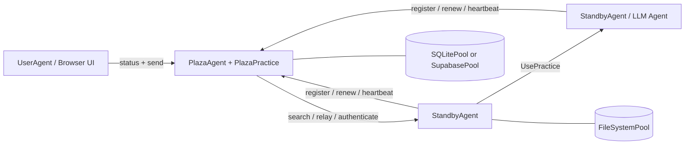

# Prompits

## 翻译版本

- [English](README.md)
- [繁體中文](README.zh-Hant.md)
- [简体中文](README.zh-Hans.md)
- [Español](README.es.md)
- [Français](README.fr.md)
- [Italiano](README.it.md)
- [Deutsch](README.de.md)
- [日本語](README.ja.md)
- [한국어](README.ko.md)

## 状态

Prompits 目前仍是一个实验性框架。它适用于本地开发、演示、研究原型以及内部基础设施探索。在独立的打包与发布流程最终确定之前，请将 API、配置结构和内置实践视为开发中状态。

## Prompits 提供的功能

- 一个托管 FastAPI 应用、挂载实践（practices）并管理 Plaza 连接的 `BaseAgent` 运行时。
- 用于工作代理（worker agents）、Plaza 协调器（coordinators）以及面向浏览器的用户代理（user agents）的具体代理角色。
- 一种 `Practice` 抽象，用于实现聊天、LLM 执行、嵌入（embeddings）、Plaza 协调和池（pool）操作等功能。
- 一种具有文件系统、SQLite 和 Supabase 后端的 `Pool` 抽象。
- 一个身份与发现层，代理可以在此进行注册、身份验证、更新令牌、心跳检测、搜索和转发消息。
- 通过 `UsePractice(...)` 进行直接的远程实践调用，并具备由 Plaza 支持的调用者验证。

## 架构


### 运行时模型

1. 每个代理程序启动一个 FastAPI 应用，并挂载内置及配置的实现（practices）。
2. 非 Plaza 代理程序向 Plaza 注册并接收：
   - 一个稳定的 `agent_id`
   - 一个持久的 `api_key`
   - 用于 Plaza 请求的短期 bearer token
3. 代理程序将 Plaza 凭据持久化到其主池中，并在重启时重复使用。
4. Plaza 维护一个可搜索的代理程序卡片与存活元数据目录。
5. 代理程序可以：
   - 向已发现的对等节点发送消息
   - 通过 Plaza 进行转发
   - 在进行调用者验证的情况下，调用另一个代理程序上的实现

## 核心概念

### Agent

Agent 是一个具有 HTTP API、一个或多个 practice 以及至少一个已配置 pool 的长期运行程序。在目前的实现中，主要的具体 Agent 类型为：

- `BaseAgent`: 共用的运行引擎
- `StandbyAgent`: 通用工作代理
- `PlazaAgent`: 协调器与注册表主机
- `UserAgent`: 构建在 Plaza APIs 之上的面向浏览器的 UI 外壳

### 练习

练习是一种挂载的能力。它将元数据发布到代理卡中，并可以公开 HTTP 端点和直接执行逻辑。

此仓库中的示例：

- 内置 `mailbox`：通用代理程序的默认消息传入机制
- `EmbeddingsPractice`: 嵌入生成
- `PlazaPractice`: 注册、续期、身份验证、搜索、心跳检测、转发
- 从配置的池中自动挂载池操作实践

### 资源池

Pool 是由 agents 与 Plaza 使用的持久化层。

- `FileSystemPool`: 透明的 JSON 文件，非常适合本地开发
- `SQLitePool`: 单节点关系型存储
- `SupabasePool`: 托管的 Postgres/PostgREST 整合

第一个配置的池是主要池。它用于代理凭证持久化和练习元数据，此外还可以挂载其他池以用于其他用例。

### Plaza

Plaza 是协调平面。它同时是：

- 一个代理主机 (`PlazaAgent`)
- 一个挂载的练习包 (`PlazaPractice`)

Plaza 的职责包括：

- 发行代理身份
- 验证 bearer tokens 或存储的凭证
- 存储可搜索的目录条目
- 追踪心跳活动
- 在代理之间转发消息
- 暴露用于监控的 UI 端点

### 消息与远程实现调用

Prompits 支持两种沟通风格：

- 以消息风格传递至同伴实现或通信端点
- 通过 `UsePractice(...)` 和 `/use_practice/{practice_id}` 进行远程实现调用

第二种路径是更具结构化的方式。调用者包含其 `PitAddress` 以及 Plaza 令牌或共享的直接令牌。接收者在执行实现前会验证该身份。

计划中的 `prompits` 功能包括：

- 为远程 `UsePractice(...)` 调用提供更强大的 Plaza 支持的身份验证与权限检查
- 一种执行前的流程，让代理程序可以在 `UsePractice(...)` 运行前协商成本、确认付款条款并完成付款
- 为跨代理程序协作提供更清晰的信任与经济边界

## 仓库布局
```text
prompits/
  agents/        Agent runtimes and UI templates
  core/          Core abstractions such as Pit, Practice, Pool, Plaza, Message
  pools/         FileSystem, SQLite, and Supabase pool backends
  practices/     Built-in practices such as chat, llm, embeddings, plaza
  tests/         Integration and unit tests for the runtime
  examples/      Minimal local config files for open source quickstarts

docs/
  CONCEPTS_AND_CLASSES.md   Detailed architecture and class reference
```

## 安装

此工作区目前从源码运行 Prompits。最简单的设置方式是使用虚拟环境并直接安装依赖项。
```bash
cd /path/to/FinMAS
python3 -m venv .venv
source .venv/bin/activate
pip install --upgrade pip
pip install fastapi "uvicorn[standard]" requests httpx pydantic python-dotenv jsonschema jinja2 pytest
```

可选依赖项：

- 如果您想使用 `SupabasePool`，请执行 `pip install supabase`
- 如果您想进行本地 llm pulser 演示或使用嵌入（embeddings），则需要一个正在运行的 Ollama 实例

## 快速入门

[`prompits/examples/`](./examples/README.md) 中的示例配置是专为本地源码检出而设计，且仅使用 `FileSystemPool`。

### 1. 启动 Plaza
```bash
python3 prompits/create_agent.py --config prompits/examples/plaza.agent
```

这会在 `http://127.0.0.1:8211` 启动 Plaza。

### 2. 启动 Worker Agent

在第二个终端中：
```bash
python3 prompits/create_agent.py --config prompits/examples/worker.agent
```

Worker 在启动时会自动向 Plaza 进行注册，将其凭证持久化在本地文件系统池中，并公开默认的 `mailbox` 端点。

### 3. 启动面向浏览器的 User Agent

在第三个终端中：
```bash
python3 prompits/create_agent.py --config prompits/examples/user.agent
```

然后打开 `http://127.0.0.1:8214/` 以查看 Plaza UI，并通过浏览器工作流发送消息。

### 4. 验证堆栈
```bash
curl http://127.0.0.1:8211/health
curl http://127.0.0.1:8214/api/plazas_status
```

第二个请求应显示 Plaza 以及目录中已注册的工作人员。

## 配置

Prompits 代理程序使用 JSON 文件进行配置，通常使用 `.agent` 后缀。

### 顶层字段

| 字段 | 是否必填 | 说明 |
| --- | --- | --- |
| `name` | 是 | 显示名称和默认代理程序身份标签 |
| `type` | 是 | 代理程序的完整 Python 类路径 |
| `host` | 是 | 要绑定的主机接口 |
| `port` | 是 | HTTP 端口 |
| `plaza_url` | 否 | 非 Plaza 代理程序的 Plaza 基础 URL |
| `role` | 否 | 用于代理程序卡的角色字符串 |
| `tags` | 否 | 可搜索的卡片标签 |
| `agent_card` | 否 | 合并到生成的卡片中的额外卡片元数据 |
| `pools` | 是 | 已配置的池后端的非空列表 |
| `practices` | 否 | 动态加载的实践类 |
| `plaza` | 否 | Plaza 特定选项，例如 `init_files` |

### 最小化 Worker 示例
```json
{
  "name": "worker-a",
  "role": "worker",
  "tags": ["demo"],
  "host": "127.0.0.1",
  "port": 8212,
  "plaza_url": "http://127.0.0.1:8211",
  "pools": [
    {
      "type": "FileSystemPool",
      "name": "worker_pool",
      "description": "Worker local pool",
      "root_path": "prompits/examples/storage/worker"
    }
  ],
  "type": "prompits.agents.standby.StandbyAgent"
}
```

### 连接池笔记

- 配置必须至少声明一个连接池。
- 第一个连接池是主连接池。
- `SupabasePool` 支持通过以下方式为 `url` 和 `key` 值提供环境变量引用：
  - `{ "env": "SUPABASE_SERVICE_ROLE_KEY" }`
  - `"env:SUPABASE_SERVICE_ROLE_KEY"`
  - `"${SUPABASE_SERVICE_ROLE_KEY}"`

### AgentConfig 合约

- `AgentConfig` 不存储在专用的 `agent_configs` 表中。
- `AgentConfig` 在 `plaza_directory` 中以 `type = "AgentConfig"` 的形式注册为 Plaza 目录条目。
- 保存的 `AgentConfig` 负载在持久化之前必须进行清理。请勿持久化仅限运行时使用的字段，例如 `uuid`、`id`、`ip`、`ip_address`、`host`、`port`、`address`、`pit_address`、`plaza_url`、`plaza_urls`、`agent_id`、`api 密钥` 或 bearer-token 字段。
- 请勿为 `AgentConfig` 重新引入独立的 `agent_configs` 表或“先读后写”的保存流程。Plaza 目录注册即为预期的唯一事实来源。

## 内置 HTTP 接口

### BaseAgent 端点

- `GET /health`: 存活探查 (liveness probe)
- `POST /use_practice/{practice_id}`: 已验证的远程练习执行

### 消息与 LLM Pulsers

- `POST /mailbox`: 由 `BaseAgent` 挂载的默认入站消息端点
- `GET /list_models`: 由 `OpenAIPulser` 等 llm pulsers 提供的供应商模型发现

### Plaza 端点

- `POST /register`
- `POST /renew`
- `POST /authenticate`
- `POST /heartbeat`
- `GET /search`
- `POST /relay`

Plaza 还提供：

- `GET /`
- `GET /plazas`
- `GET /api/plazas_status`
- `GET /.well-known/agent-card`

## 程序化用法

测试展示了最可靠的程序化用法示例。典型的消息发送流程如下：
```python
from prompits.agents.standby import StandbyAgent

caller = StandbyAgent(
    name="caller",
    host="127.0.0.1",
    port=9001,
    plaza_url="http://127.0.0.1:8211",
    agent_card={"name": "caller", "role": "client", "tags": ["demo"]},
)

caller.register()

result = caller.send(
    "http://127.0.0.1:9002",
    {"prompt": "Return a short greeting."},
    msg_type="message",
)
```

若要进行结构化的跨代理执行，请使用 `UsePractice(...)` 并挂载一个练习，例如 pulser 上的 `get_pulse_data`。

## 开发与测试

使用以下命令运行 Prompits 测试套件：
```bash
pytest prompits/tests -q
```

入门时建议阅读的实用测试文件：

- `prompits/tests/test_plaza.py`
- ` prompits/tests/test_plaza_config.py`
- `prompits/tests/test_agent_pool_credentials.py`
- `prompits/tests/test_use_practice_remote_llm.py`
- `prompits/tests/test_user_ui.py`

## 开源定位

与早期的公开 `alvincho/prompits` 仓库相比，目前的实现较少涉及抽象术语，而更多是关于一个可运行的基础设施界面：

- 基于 FastAPI 的具体代理，而非仅仅是概念性的架构
- 真实凭证持久化与 Plaza token 续期
- 可搜索的代理卡片与中继行为
- 具备验证功能的直接远程实现执行
- 用于 Plaza 检查的内置 UI 端点

这使得此代码库成为开源发布的更强大基础，特别是如果您将 Prompits 呈现为：

- 多代理系统的基础设施层
- 一个用于探索、身份、路由与实践执行的框架
- 一个可供高阶代理系统在其之上构建的基础运行时

## 进阶阅读

- [详细概念与类参考](../docs/CONCEPTS_AND_CLASSES.md)
- [示例配置](./examples/README.md)
