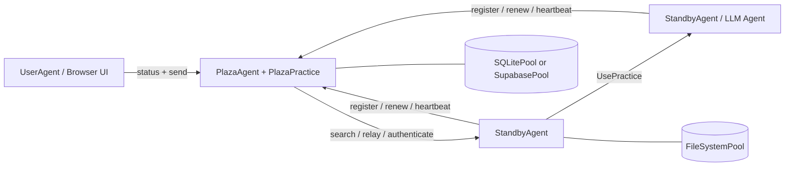

# Prompits

## 翻譯版本

- [English](README.md)
- [繁體中文](README.zh-Hant.md)
- [简体中文](README.zh-Hans.md)
- [Español](README.es.md)
- [Français](README.fr.md)
- [Italiano](README.it.md)
- [Deutsch](README.de.md)
- [日本語](README.ja.md)
- [한국어](README.ko.md)

## 狀態

Prompits 目前仍是一個實驗性框架。它適用於本地開發、演示、研究原型以及內部基礎設施探索。在獨立的打包與發佈流程最終確定之前，請將 API、配置結構和內建實踐視為開發中狀態。

## Prompits 提供的功能

- 一個託管 FastAPI 應用程式、掛載實踐（practices）並管理 Plaza 連線的 `BaseAgent` 運行時。
- 用於工作代理（worker agents）、Plaza 協調器（coordinators）以及面向瀏覽器的用戶代理（user agents）的具體代理角色。
- 一種 `Practice` 抽象，用於實現聊天、LLM 執行、嵌入（embeddings）、Plaza 協調和池（pool）操作等功能。
- 一種具有檔案系統、SQLite 和 Supabase 後端的 `Pool` 抽象。
- 一個身份與發現層，代理可以在此進行註冊、身份驗證、更新令牌、心跳檢測、搜尋和轉發訊息。
- 透過 `UsePractice(...)` 進行直接的遠端實踐調用，並具備由 Plaza 支持的調用者驗證。

## 架構


### 執行時模型

1. 每個代理程式啟動一個 FastAPI 應用程式，並掛載內建及配置的實作（practices）。
2. 非 Plaza 代理程式向 Plaza 註冊並接收：
   - 一個穩定的 `agent_id`
   - 一個持久的 `api_key`
   - 用於 Plaza 請求的短期 bearer token
3. 代理程式將 Plaza 憑證持久化到其主要池中，並在重啟時重複使用。
4. Plaza 維持一個可搜尋的代理程式卡片與存活元數據目錄。
5. 代理程式可以：
   - 向已發現的對等節點發送訊息
   - 透過 Plaza 進行轉發
   - 在進行呼叫者驗證的情況下，調用另一個代理程式上的實作

## 核心概念

### Agent

Agent 是一個具有 HTTP API、一個或多個 practice 以及至少一個已配置 pool 的長期運行程序。在目前的實作中，主要的具體 Agent 類型為：

- `BaseAgent`: 共用的執行引擎
- `StandbyAgent`: 通用工作代理
- `PlazaAgent`: 協調器與註冊表主機
- `UserAgent`: 建立在 Plaza APIs 之上的面向瀏覽器的 UI 外殼

### 練習

練習是一種掛載的能力。它將元數據發佈到代理卡中，並可以公開 HTTP 端點和直接執行邏輯。

此儲存庫中的範例：

- 內建 `mailbox`：通用代理程式的預設訊息傳入機制
- `EmbeddingsPractice`: 嵌入生成
- `PlazaPractice`: 註冊、續期、身分驗證、搜尋、心跳檢測、轉發
- 從配置的池中自動掛載池操作實踐

### 資源池

Pool 是由 agents 與 Plaza 使用的持久化層。

- `FileSystemPool`: 透明的 JSON 檔案，非常適合本地開發
- `SQLitePool`: 單節點關聯式儲存
- `SupabasePool`: 託管的 Postgres/PostgREST 整合

第一個配置的池是主要池。它用於代理憑證持久化和練習元數據，此外還可以掛載其他池以用於其他用例。

### Plaza

Plaza 是協調平面。它同時是：

- 一個代理主機 (`PlazaAgent`)
- 一個掛載的練習包 (`PlazaPractice`)

Plaza 的職責包括：

- 發行代理身份
- 驗證 bearer tokens 或儲存的憑證
- 儲存可搜尋的目錄項目
- 追蹤心跳活動
- 在代理之間轉發訊息
- 暴露用於監控的 UI 端點

### 訊息與遠端實作調用

Prompits 支援兩種溝通風格：

- 以訊息風格傳遞至同儕實作或通訊端點
- 透過 `UsePractice(...)` 和 `/use_practice/{practice_id}` 進行遠端實作調用

第二種路徑是更具結構化的方式。調用者包含其 `PitAddress` 以及 Plaza 權杖或共享的直接權杖。接收者在執行實作前會驗證該身份。

計畫中的 `prompits` 功能包括：

- 為遠端 `UsePractice(...)` 調用提供更強大的 Plaza 支援身份驗證與權限檢查
- 一種執行前的流程，讓代理程式可以在 `UsePractice(...)` 執行前協商成本、確認付款條款並完成付款
- 為跨代理程式協作提供更清晰的信任與經濟邊界

## 儲存庫佈局
```text
prompits/
  agents/        Agent runtimes and UI templates
  core/          Core abstractions such as Pit, Practice, Pool, Plaza, Message
  pools/         FileSystem, SQLite, and Supabase pool backends
  practices/     Built-in practices such as chat, llm, embeddings, plaza
  tests/         Integration and unit tests for the runtime
  examples/      Minimal local config files for open source quickstarts

docs/
  CONCEPTS_AND_CLASSES.md   Detailed architecture and class reference
```

## 安裝

此工作區目前從原始碼執行 Prompits。最簡單的設置方式是使用虛擬環境並直接安裝依賴項目。
```bash
cd /path/to/FinMAS
python3 -m venv .venv
source .venv/bin/activate
pip install --upgrade pip
pip install fastapi "uvicorn[standard]" requests httpx pydantic python-dotenv jsonschema jinja2 pytest
```

選用依賴項目：

- 如果您想使用 `SupabasePool`，請執行 `pip install supabase`
- 如果您想進行本地 llm pulser 演示或使用嵌入（embeddings），則需要一個正在運行的 Ollama 實例

## 快速入門

[`prompits/examples/`](./examples/README.md) 中的範例配置是專為本地原始碼檢出而設計，且僅使用 `FileSystemPool`。

### 1. 啟動 Plaza
```bash
python3 prompits/create_agent.py --config prompits/examples/plaza.agent
```

這會在 `http://127.0.0.1:8211` 啟動 Plaza。

### 2. 啟動 Worker Agent

在第二個終端機中：
```bash
python3 prompits/create_agent.py --config prompits/examples/worker.agent
```

Worker 在啟動時會自動向 Plaza 進行註冊，將其憑證持久化在本地文件系統池中，並公開預設的 `mailbox` 端點。

### 3. 啟動面向瀏覽器的 User Agent

在第三個終端機中：
```bash
python3 prompits/create_agent.py --config prompits/examples/user.agent
```

然後開啟 `http://127.0.0.1:8214/` 以查看 Plaza UI，並透過瀏覽器工作流發送訊息。

### 4. 驗證堆疊
```bash
curl http://127.0.0.1:8211/health
curl http://127.0.0.1:8214/api/plazas_status
```

第二個請求應顯示 Plaza 以及目錄中已註冊的工作人員。

## 組態

Prompits 代理程式使用 JSON 檔案進行組態，通常使用 `.agent` 字尾。

### 頂層欄位

| 欄位 | 必要 | 說明 |
| --- | --- | --- |
| `name` | 是 | 顯示名稱與預設代理程式身分標籤 |
| `type` | 是 | 代理程式的完整 Python 類別路徑 |
| `host` | 是 | 要綁定的主機介面 |
| `port` | 是 | HTTP 連接埠 |
| `plaza_url` | 否 | 非 Plaza 代理程式的 Plaza 基本 URL |
| `role` | 否 | 用於代理程式卡片的角色字串 |
| `tags` | 否 | 可搜尋的卡片標籤 |
| `agent_card` | 否 | 合併到生成卡片中的額外卡片元數據 |
| `pools` | 是 | 已組態的池後端非空列表 |
| `practices` | 否 | 動態載入的實作類別 |
| `plaza` | 否 | Plaza 特定選項，例如 `init_files` |

### 最小化 Worker 範例
```json
{
  "name": "worker-a",
  "role": "worker",
  "tags": ["demo"],
  "host": "127.0.0.1",
  "port": 8212,
  "plaza_url": "http://127.0.0.1:8211",
  "pools": [
    {
      "type": "FileSystemPool",
      "name": "worker_pool",
      "description": "Worker local pool",
      "root_path": "prompits/examples/storage/worker"
    }
  ],
  "type": "prompits.agents.standby.StandbyAgent"
}
```

### 連集筆記

- 設定必須至少宣告一個連集。
- 第一個連集為主要連集。
- `SupabasePool` 支援透過以下方式為 `url` 和 `key` 值提供環境變數引用：
  - `{ "env": "SUPABASE_SERVICE_ROLE_KEY" }`
  - `"env:SUPABASE_SERVICE_ROLE_KEY"`
  - `"${SUPABASE_SERVICE_ROLE_KEY}"`

### AgentConfig 合約

- `AgentConfig` 並未儲存在專用的 `agent_configs` 資料表中。
- `AgentConfig` 在 `plaza_directory` 中以 `type = "AgentConfig"` 的形式註冊為 Plaza 目錄條目。
- 儲存的 `AgentConfig` 負載在持久化之前必須經過清理。請勿持久化僅限於運行時的欄位，例如 `uuid`、`id`、`ip`、`ip_radius`、`host`、`port`、`address`、`pit_address`、`plaza_url`、`plaza_urls`、`agent_id`、`api_key` 或 bearer-token 欄位。
- 請勿為 `AgentConfig` 重新引入獨立的 `agent_configs` 資料表或「先讀後寫」的儲存流程。Plaza 目錄註冊即為預期的單一事實來源。

## 內建 HTTP 介面

### BaseAgent 端點

- `GET /health`: 存活探測 (liveness probe)
- `POST /use_practice/{practice_id}`: 已驗證的遠端練習執行

### 訊息與 LLM Pulsers

- `POST /mailbox`: 由 `BaseAgent` 掛載的預設入站訊息端點
- `GET /list_models`: 由 `OpenAIPulser` 等 llm pulsers 提供的供應商模型發現

### Plaza 端點

- `POST /register`
- `POST /renew`
- `POST /authenticate`
- `POST /heartbeat`
- `GET /search`
- `POST /relay`

Plaza 還提供：

- `GET /`
- `GET /plazas`
- `GET /api/plazas_status`
- `GET /.well-known/agent-card`

## 程式化用法

測試展示了最可靠的程式化用法範例。典型的訊息傳送流程如下：
```python
from prompits.agents.standby import StandbyAgent

caller = StandbyAgent(
    name="caller",
    host="127.0.0.1",
    port=9001,
    plaza_url="http://127.0.0.1:8211",
    agent_card={"name": "caller", "role": "client", "tags": ["demo"]},
)

caller.register()

result = caller.send(
    "http://127.0.0.1:9002",
    {"prompt": "Return a short greeting."},
    msg_type="message",
)
```

若要進行結構化的跨代理執行，請使用 `UsePractice(...)` 並掛載一個練習，例如 pulser 上的 `get_pulse_data`。

## 開發與測試

使用以下指令執行 Prompits 測試套件：
```bash
pytest prompits/tests -q
```

入門時建議閱讀的實用測試檔案：

- `prompits/tests/test_plaza.py`
- `prompits/tests/test_plaza_config.py`
- `prompits/tests/test_agent_pool_credentials.py`
- `prompits/tests/test_use_practice_remote_llm.py`
- `prompits/tests/test_user_ui.py`

## 開源定位

與早期的公開 `alvincho/prompits` 儲存庫相比，目前的實作較少涉及抽象術語，而更多是關於一個可運行的基礎設施介面：

- 基於 FastAPI 的具體代理，而非僅僅是概念性的架構
- 真實憑證持久化與 Plaza token 續期
- 可搜尋的代理卡片與中繼行為
- 具備驗證功能的直接遠端實作執行
- 用於 Plaza 檢查的內建 UI 端點

這使得此代碼庫成為開源發佈的更強大基礎，特別是如果您將 Prompits 呈現為：

- 多代理系統的基礎設施層
- 一個用於探索、身分、路由與實作執行的框架
- 一個可供高階代理系統在其之上構建的基礎運行時

## 進階閱讀

- [詳細概念與類別參考](../docs/CONCEPTS_AND_CLASSES.md)
- [範例配置](./examples/README.md)
